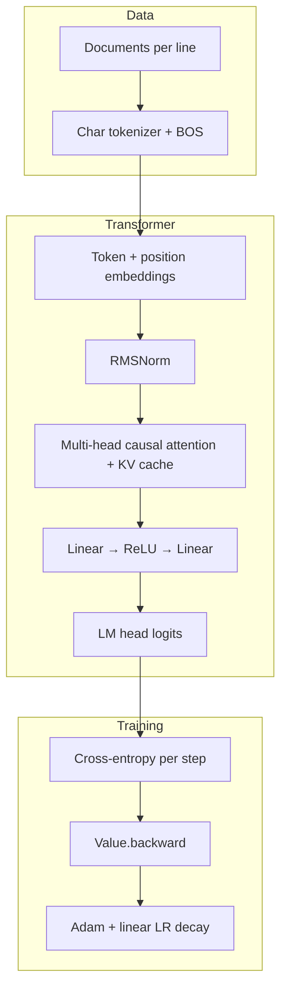

# microGPT

A **minimal, dependency-free** implementation of a **character-level GPT** in pure Python: scalar autograd (`Value`), a compact transformer (token and position embeddings, multi-head causal self-attention with a KV cache, RMSNorm, MLP, language-model head), **Adam** with bias correction, and sampling-based generation. It is aimed at **learning** how transformers and autograd work—not at training large models efficiently.

The design follows the [microGPT / makemore](https://github.com/karpathy/makemore) style and [Andrej Karpathy’s microGPT write-up](https://karpathy.github.io/2026/02/12/microgpt/).

**There is no `requirements.txt` or `pyproject.toml` on purpose:** only the Python 3 standard library.

---

## Why this repo exists

- **Readable end-to-end story**: You can read one file and see data → tokens → forward → loss → backward → optimizer → sampling.
- **No PyTorch / NumPy**: Gradients are computed with explicit `Value` nodes and the chain rule, so the mechanics of autograd are visible.
- **Small enough to run locally**: Default settings train in ~1000 steps on a names corpus; generation prints a handful of sampled strings.

Training is **intentionally slow** (scalar ops in Python). That is expected and part of the pedagogical tradeoff.

---

## Requirements

- **Python 3** (the refactored script uses `from __future__ import annotations` and type hints).

---

## Quick start

```bash
# Recommended: structured entry with types, Tokeniser, train()/generate()/main()
python microgpt_updated.py

# Compact “single narrative” script (global state, blog-style layout)
python microgpt.py
```

**What you should see:** dataset size, vocabulary size, parameter count, training loss printed per step (updating on one line), then a short banner and **20** sampled lines (default task: hallucinated names).

**`microgpt_updated.py` only:** it also saves a **run report** file in the current directory (see [Run reports](#run-reports)). The compact `microgpt.py` does not write this file.

If `input.txt` is missing, both scripts download the classic names list from the makemore repository.

---

## Data

| Item | Detail |
|------|--------|
| **Default file** | `input.txt` — **one document per line** (the demo uses one name per line). |
| **Format** | Plain text; empty lines are skipped. Characters not present in the file never appear in the vocabulary. |
| **Fallback** | Scripts can fetch names from `https://raw.githubusercontent.com/karpathy/makemore/988aa59/names.txt` if `input.txt` does not exist. |

Replace `input.txt` with your own line-oriented corpus to change what the model learns (keep lines short enough to fit `BLOCK_SIZE` / `block_size`, or increase context in the code).

---

## Repository layout

| Path | Role |
|------|------|
| **`microgpt_updated.py`** | Refactored **entry**: hyperparameters, `train()` / `generate()` / `main()`, `save_run_report()`. Imports **`mgpt/`** (model + autograd + data) and **`run_report/`** (report text format). **Prefer this for new features, tests, or structural changes.** |
| **`mgpt/`** | Package: `Value`, tensor ops, transformer step `gpt()`, `load_dataset` / `build_tokeniser`. Stdlib only. |
| **`run_report/`** | Package: parsing saved reports, narrative text, output filename encoding, assembling a full report file. Used by the entry script and the two report utilities below. |
| **`microgpt.py`** | Compact version: one continuous script with module-level state; closest to a “single-file walkthrough.” |
| **`annotate_run_reports.py`** | Utility script: inserts the `--- What this run is ---` narrative into **existing** `output_*.txt` files (so older runs match the current report format). |
| **`compare_run_reports.py`** | Utility script: compares two saved run reports (parsed config, final loss, ordered inference samples). Exit code `0` if all match, `1` if something differs, `2` on usage or parse errors. |
| **`input.txt`** | Training data (optional if download path runs). |
| **`output_*.txt`** | Optional: written by `microgpt_updated.py` after a run; not produced by `microgpt.py`. Names encode hyperparameters and a local `_YYYYMMDD_HHMMSS` suffix (see [Run reports](#run-reports)). |
| **`README.md`** | This overview (architecture, config, run reports). |
| **`CLAUDE.md`** | Maintainer / assistant context: conventions, internals, which file to edit. |
| **`AGENT.md`** | Short pointer to `CLAUDE.md` for agent harnesses. |

---

## Architecture (high level)



**Block details (GPT-2–like with deliberate simplifications):**

- **Tokenisation**: Character-level; vocabulary = unique characters in the corpus plus a **BOS** (beginning-of-sequence) id. Each line is wrapped with BOS at both ends so the model learns to start and stop.
- **Embedding**: Learned **token** (`wte`) and **position** (`wpe`) tables added together, then **RMSNorm** (not LayerNorm).
- **Attention**: Multi-head causal self-attention; **scaled dot-product** attention; keys and values are **appended to a per-layer KV cache** as the sequence is processed (same structure used in training forward and generation).
- **Residuals**: Pre-norm style blocks (normalize → sublayer → add residual) for attention and MLP.
- **MLP**: Expand (typically `4 * n_embd`) → **ReLU** → project back (Karpathy notes **GELU** in full GPT-2; this code uses ReLU for simplicity).
- **Output**: Linear `lm_head` maps the final hidden state to logits over the vocabulary.
- **No biases** on linear layers (as in the reference write-up).

**Autograd:** Each scalar is a `Value` with children and local gradients; `loss.backward()` builds a topological order and accumulates gradients. This mirrors the idea behind `tensor.backward()` in frameworks, but at scalar granularity.

**Optimisation:** Adam (`beta1`, `beta2`, `eps`) with **bias-corrected** moments and **linear learning rate decay** to zero over the training run.

**Inference:** Start from BOS; sample the next character from the softmax distribution; **temperature** scales logits before softmax (`logits / temperature`). Stop at BOS again or at max length (`BLOCK_SIZE` / `block_size`).

---

## Run reports

The refactored script saves a text summary of a training run: a short **narrative** section (`--- What this run is ---`) that explains the input file, the training setup, and how to read the final loss and generated samples; an optional **experiment suite** block for variant sweeps; a flat **config** listing; the last-step **loss**; **inference samples**; and a **parameter glossary** (including how the output filename is encoded).

- **Default path:** built from hyperparameters, e.g. `output_L1_E16_H4_D4_B16_S1000_T0p5_seed42_20260422_153045.txt`. The stem encodes `L/E/H/D/B/S/T/seed` plus a trailing **`_YYYYMMDD_HHMMSS`** suffix in **local wall-clock time** when the path is built, so repeat runs with the same hyperparameters do not overwrite earlier reports. In the `T` token, the decimal point is written as `p` (and a leading minus as `m`) so the stem stays token-friendly. See `format_run_output_path()` in `microgpt_updated.py` (wrapper) and `format_run_output_path_for_params()` in `run_report/paths.py`.
- **Past reports:** to add or refresh the narrative on files saved before the narrative existed, run from the repo root:

  ```bash
  python annotate_run_reports.py
  python annotate_run_reports.py path/to/output_L1_....txt
  ```

  The script skips files that already contain `--- What this run is ---`.

### Comparing two reports

Use **`compare_run_reports.py`** when you want a quick diff between runs (e.g. after a hyperparameter sweep or a code change): it prints differences in the **config block** (`N_LAYER`, `N_EMBD`, optimiser fields, `INPUT_PATH`, etc.), the **final training loss**, and each **inference sample** line (side-by-side; `*` marks a mismatch). Narrative text, experiment-suite notes, and the parameter glossary are ignored.

From the repo root:

```bash
python compare_run_reports.py path/to/output_A.txt path/to/output_B.txt
```

**Exit codes:** `0` — parsed config, loss, and all sample strings match; `1` — at least one difference; `2` — wrong number of arguments, a path is not a file, or a report could not be parsed (e.g. missing final loss line).

---

## Configuration

Hyperparameters are **constants at the top of each script** (not CLI flags or env vars).

### `microgpt_updated.py` (recommended reference)

| Symbol | Default | Role |
|--------|---------|------|
| `N_LAYER` | `1` | Transformer depth |
| `N_EMBD` | `16` | Model width / embedding dimension |
| `BLOCK_SIZE` | `16` | Max context length (positions 0 … `BLOCK_SIZE - 1`) |
| `N_HEAD` | `4` | Attention heads (`HEAD_DIM = N_EMBD // N_HEAD`) |
| `LEARNING_RATE` | `0.01` | Base Adam step size (scaled by linear decay) |
| `BETA1` | `0.85` | Adam first-moment decay |
| `BETA2` | `0.99` | Adam second-moment decay |
| `EPS_ADAM` | `1e-8` | Adam epsilon |
| `NUM_STEPS` | `1000` | Training steps (one random document per step, modulo dataset size) |
| `TEMPERATURE` | `0.5` | Sampling temperature for generation |
| `SEED` | `42` | RNG seed |
| `NAMES_URL` | makemore `names.txt` | Download URL if `input.txt` missing |
| `INPUT_PATH` | `"input.txt"` | Training file path |
| `EXPERIMENT_SUITE_INDEX` | `None` | Optional 1-based index of this run in a multi-run sweep (see `EXPERIMENT_SUITE_TOTAL`). |
| `EXPERIMENT_SUITE_TOTAL` | `None` | Optional total number of runs; with `EXPERIMENT_SUITE_INDEX` set, the report prints `Experiment: i / n`. |
| `EXPERIMENT_SUITE_NOTE` | `None` | Optional one-line description (e.g. what is being swept), shown as `Suite note: …`. The `--- Experiment suite ---` block is omitted only when **all three** of these are `None`. |

### `microgpt.py` (compact script)

Same roles under lowercase names: `n_layer`, `n_embd`, `block_size`, `n_head`, `head_dim`, `learning_rate`, `beta1`, `beta2`, `eps_adam`, `num_steps`, `temperature`, plus inline `names_url` and `'input.txt'`.

**Practical tips:**

- Increase **`N_EMBD` / `n_embd`** or **`N_LAYER` / `n_layer`** only if you accept much slower training.
- **`BLOCK_SIZE` / `block_size`** must be at least the longest sequence you need (including BOS tokens on both sides).
- **`TEMPERATURE` / `temperature`**: lower → sharper / more “typical” samples; higher → more diverse.

---

## Developing further

- **Dependency policy**: Keep the project **stdlib-only** unless maintainers explicitly add third-party packages.
- **Where to edit**: Use **`microgpt_updated.py`** for the training/generation orchestration and **`mgpt/`** for model or autograd internals; keep **`microgpt.py`** aligned with the “one file narrative” when possible. Report layout and parsing live in **`run_report/`**.
- **Run report text**: The human-readable story in `--- What this run is ---` is implemented in **`run_report/narrative.py`** (`format_run_narrative_lines`); `annotate_run_reports.py` imports it so backfilled files match new runs.
- **Comparing reports**: After two runs, `python compare_run_reports.py output_….txt output_….txt` summarizes config / loss / sample diffs (see [Comparing two reports](#comparing-two-reports)).
- **Educational comments**: The refactored file includes explanatory comments; avoid stripping them without an explicit request.
- **KV cache and training**: During training, cached keys/values are part of the live graph for that forward (they are not treated as detached inference-only tensors). Understand this before changing caching behavior.
- **Testing**: There is no bundled test suite yet; if you add one, documenting the command in this README (e.g. `pytest`) is welcome.

For assistant-oriented conventions and file-choice guidance, see **[`CLAUDE.md`](./CLAUDE.md)**.

---

## Further reading

- [microGPT — fully deterministic backpropagation through a GPT-2 forward pass](https://karpathy.github.io/2026/02/12/microgpt/) (blog post)
- [karpathy/makemore](https://github.com/karpathy/makemore) (related character-level models and datasets)
