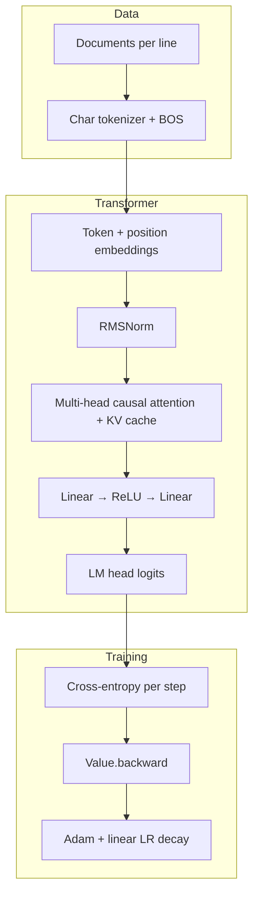
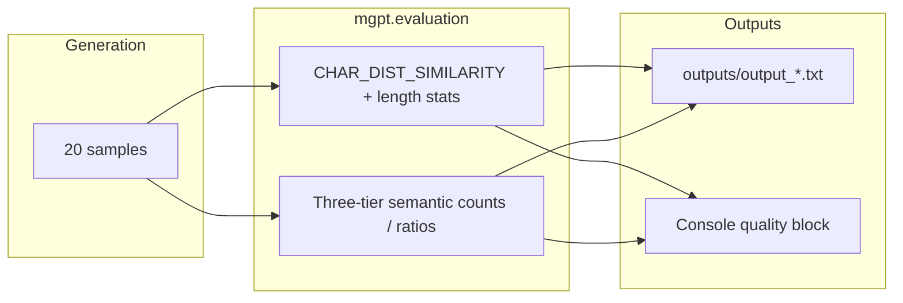

# microGPT

A **minimal, dependency-free** implementation of a **character-level GPT** in pure Python: scalar autograd (`Value`), a compact transformer (token and position embeddings, multi-head causal self-attention with a KV cache, RMSNorm, MLP, language-model head), **Adam** with bias correction, and sampling-based generation. It is aimed at **learning** how transformers and autograd work—not at training large models efficiently.

The design follows the [microGPT / makemore](https://github.com/karpathy/makemore) style and [Andrej Karpathy’s microGPT write-up](https://karpathy.github.io/2026/02/12/microgpt/).

**There is no `requirements.txt` or `pyproject.toml` on purpose:** only the Python 3 standard library.

---

## Why this repo exists

- **Readable end-to-end story**: You can read one file and see data → tokens → forward → loss → backward → optimizer → sampling.
- **No PyTorch / NumPy**: Gradients are computed with explicit `Value` nodes and the chain rule, so the mechanics of autograd are visible.
- **Small enough to run locally**: Default settings train in ~1000 steps on a names corpus; generation prints a handful of sampled strings.

Training is **intentionally slow** (scalar ops in Python). That is expected and part of the pedagogical tradeoff.

---

## Requirements

- **Python 3** (the refactored script uses `from __future__ import annotations` and type hints).

---

## Quick start

```bash
# Recommended: structured entry with types, Tokeniser, train()/generate()/main()
python microgpt_updated.py

# Same defaults, but override hyperparameters for this run (no file edits)
python microgpt_updated.py --help   # lists all flags
# See [How to use microgpt_updated.py](#how-to-use-microgpt_updatedpy) and [Run experiments examples](#run-experiments-examples)

# Compact “single narrative” script (global state, blog-style layout)
python microgpt.py
```

**What you should see:** dataset size, vocabulary size, parameter count, training loss printed per step (updating on one line), then a short banner and **20** sampled lines (default task: hallucinated names). After that, **`microgpt_updated.py`** prints a **sample quality** summary (character-level similarity to the training corpus plus a three-tier semantic heuristic: real / plausible / nonsense).

**`microgpt_updated.py` only:** it also saves a **run report** under **`outputs/`** (created if missing; see [Run reports](#run-reports)). Filenames use stem tokens `L`/`E`/`H`/`B`/… (no separate token for per-head width; that follows from `N_EMBD` and `N_HEAD`). The compact `microgpt.py` does not write this file. CLI flags only exist on the refactored entry; `microgpt.py` remains edit-the-constants only.

If `input.txt` is missing, both scripts download the classic names list from the makemore repository.

### How to use microgpt_updated.py

Together, the sections below cover **everything you need** to drive this script:

| Topic | Where |
|--------|--------|
| **Baseline run** (module defaults, no edits) | [Quick start](#quick-start): `python microgpt_updated.py` |
| **All CLI flags** | `python microgpt_updated.py --help` and the [Configuration](#configuration) table (`--n-layer` … `--suite-note`) |
| **Custom data file** | `--input path/to/file.txt` (same one-line-per-document format as `input.txt`) |
| **Source-only knobs** (no CLI yet) | Edit the file for `EPS_ADAM`, `NAMES_URL`, or defaults you want when omitting flags |
| **Reproduce project sweeps** | [Run experiments examples](#run-experiments-examples) (distinct `N_HEAD` × `NUM_STEPS` from saved `output_*.txt`) |
| **Label runs for HTML tables** | [Configuration](#configuration) example: `--suite-index` / `--suite-total` / `--suite-note` |
| **Diff or aggregate reports** | [Run reports](#run-reports): `compare_run_reports.py`, `experiments/report_generator.py` (both expect paths under **`outputs/`** by convention; defaults use `run_reports_dir`). Config **diffs and HTML “shared / varying” tables omit `HEAD_DIM`** (derived from `N_EMBD` and `N_HEAD`). |

Illustrative one-offs (not tied to the sweep table):

```bash
python microgpt_updated.py --temperature 0.8 --seed 0
python microgpt_updated.py --input my_corpus.txt --num-steps 500
```

## Run experiments examples

These commands match the **distinct hyperparameter combinations** seen in `outputs/output_L*.txt` run reports from experiments in this project (`L=1`, `E=16`, `B=16`, `T=0.5`, `seed=42`; sweeps varied **`N_HEAD`** and **`NUM_STEPS`** only). Omitted flags use the defaults at the top of `microgpt_updated.py`. (The `outputs/` directory is gitignored; regenerate reports with the lines below from the repo root.)

```bash
# 4 heads, 1000 steps — multi-head baseline (output_L1_E16_H4_B16_S1000_*.txt)
python microgpt_updated.py

# 4 heads, 2000 steps — longer multi-head run (output_L1_E16_H4_B16_S2000_*.txt)
python microgpt_updated.py --num-steps 2000

# 1 head, 1000 steps — single-head baseline (output_L1_E16_H1_B16_S1000_*.txt)
python microgpt_updated.py --n-head 1

# 1 head, 50 steps — short training / ablation (output_L1_E16_H1_B16_S50_*.txt)
python microgpt_updated.py --n-head 1 --num-steps 50

# 1 head, 2000 steps — single-head long run (output_L1_E16_H1_B16_S2000_*.txt)
python microgpt_updated.py --n-head 1 --num-steps 2000
```

Each run writes a new `outputs/output_*.txt` whose stem encodes the effective config (plus a local timestamp). Compare reports with `compare_run_reports.py` or `experiments/report_generator.py` (see [Run reports](#run-reports)).

**Tests** (optional; requires `pytest` installed in your environment):

```bash
python -m pytest tests/ -q
```

---

## Data

| Item | Detail |
|------|--------|
| **Default file** | `input.txt` — **one document per line** (the demo uses one name per line). |
| **Format** | Plain text; empty lines are skipped. Characters not present in the file never appear in the vocabulary. |
| **Fallback** | Scripts can fetch names from `https://raw.githubusercontent.com/karpathy/makemore/988aa59/names.txt` if `input.txt` does not exist. |

Replace `input.txt` with your own line-oriented corpus to change what the model learns (keep lines short enough to fit `BLOCK_SIZE` / `block_size`, or increase context in the code).

---

## Repository layout

| Path | Role |
|------|------|
| **`microgpt_updated.py`** | Refactored **entry**: hyperparameters (module constants **or** optional `argparse` CLI), `train()` / `generate()` / `main()`, `save_run_report()`. Imports **`mgpt/`** (model + autograd + data) and **`run_report/`** (report text format). **Prefer this for new features, tests, or structural changes.** |
| **`mgpt/`** | Package: `Value`, tensor ops, transformer step `gpt()`, `load_dataset` / `build_tokeniser`, **`evaluation.py`** (character similarity + three-tier semantic heuristics for generated samples). Stdlib only. |
| **`run_report/`** | Package: parse/compare saved reports (`parse.py`), narrative (`narrative.py`), **`paths.py`** (`DEFAULT_RUN_REPORT_DIR`, **`run_reports_dir(repo_root)`** — shared location for `outputs/`), full report assembly (`builder.py`), **text loss visuals** (`text_loss_plot.py`). Used by the entry script, `annotate_run_reports.py`, `compare_run_reports.py`, and **`experiments/report_generator.py`**. |
| **`experiments/`** | Optional tooling: **`report_generator.py`** builds an **HTML** report (config diff, quality table, sample grid, optional loss ASCII, tier bars). Stdlib only; adds repo root to `sys.path` so it can be run from any working directory. |
| **`tests/`** | `pytest` suite: evaluation / report round-trips, text loss plot helpers. |
| **`microgpt.py`** | Compact version: one continuous script with module-level state; closest to a “single-file walkthrough.” |
| **`annotate_run_reports.py`** | Utility script: inserts the `--- What this run is ---` narrative into **existing** `output_*.txt` files (default glob: **`outputs/`**; so older runs match the current report format). |
| **`compare_run_reports.py`** | Utility script: compares two saved run reports (parsed config, final loss, ordered inference samples). Exit code `0` if all match, `1` if something differs, `2` on usage or parse errors. |
| **`input.txt`** | Training data (optional if download path runs). |
| **`outputs/`** | Default directory for run reports (`output_*.txt`) and `comparison_report.html`; gitignored. Created automatically on write. |
| **`output_*.txt`** | Optional: written by `microgpt_updated.py` under **`outputs/`** by default; not produced by `microgpt.py`. Names encode hyperparameters and a local `_YYYYMMDD_HHMMSS` suffix (see [Run reports](#run-reports)). |
| **`README.md`** | This overview (architecture, config, run reports). |
| **`CLAUDE.md`** | Maintainer / assistant context: conventions, internals, which file to edit. |
| **`AGENT.md`** | Short pointer to `CLAUDE.md` for agent harnesses. |

---

## Architecture (high level)



**After training (refactored entry only):** generated strings are scored for corpus similarity and coarse “makes sense” tiers; metrics are printed and embedded in the saved report.



**Block details (GPT-2–like with deliberate simplifications):**

- **Tokenisation**: Character-level; vocabulary = unique characters in the corpus plus a **BOS** (beginning-of-sequence) id. Each line is wrapped with BOS at both ends so the model learns to start and stop.
- **Embedding**: Learned **token** (`wte`) and **position** (`wpe`) tables added together, then **RMSNorm** (not LayerNorm).
- **Attention**: Multi-head causal self-attention; **scaled dot-product** attention; keys and values are **appended to a per-layer KV cache** as the sequence is processed (same structure used in training forward and generation).
- **Residuals**: Pre-norm style blocks (normalize → sublayer → add residual) for attention and MLP.
- **MLP**: Expand (typically `4 * n_embd`) → **ReLU** → project back (Karpathy notes **GELU** in full GPT-2; this code uses ReLU for simplicity).
- **Output**: Linear `lm_head` maps the final hidden state to logits over the vocabulary.
- **No biases** on linear layers (as in the reference write-up).

**Autograd:** Each scalar is a `Value` with children and local gradients; `loss.backward()` builds a topological order and accumulates gradients. This mirrors the idea behind `tensor.backward()` in frameworks, but at scalar granularity.

**Optimisation:** Adam (`beta1`, `beta2`, `eps`) with **bias-corrected** moments and **linear learning rate decay** to zero over the training run.

**Inference:** Start from BOS; sample the next character from the softmax distribution; **temperature** scales logits before softmax (`logits / temperature`). Stop at BOS again or at max length (`BLOCK_SIZE` / `block_size`).

---

## Run reports

The refactored script saves a text summary of a training run: a short **narrative** section (`--- What this run is ---`) that explains the input file, the training setup, and how to read the final loss and generated samples; an optional **experiment suite** block for variant sweeps; a flat **config** listing; the last-step **loss**; optional **sample quality** (`--- Sample quality (character-level) ---`: `CHAR_DIST_SIMILARITY`, average sample length, length similarity); optional **semantic quality** (`--- Semantic quality (three-tier) ---`: tier counts/ratios, overall score, commented example lines); optional **`--- Loss history (CSV: step,loss) ---`** (one row per training step, for plotting or diff tools); **inference samples**; and a **parameter glossary** (including how the output filename is encoded). **Architecture in the config block** is the primary pair **`N_EMBD`** and **`N_HEAD`**. Per-head width is **not** a separate `KEY=value` line; it appears as a **`#` comment** (`HEAD_DIM = N_EMBD // N_HEAD = …`). Parsers still populate `HEAD_DIM` in the in-memory config (`run_report.parse.parse_run_report_text`) for tools that expect it.

- **Default path:** **`<microgpt repo>/outputs/`** + filename built from hyperparameters, e.g. `outputs/output_L1_E16_H4_B16_S1000_T0p5_seed42_20260422_153045.txt`. The folder is `run_reports_dir(repo_root)` in `run_report.paths` (i.e. `repo_root / DEFAULT_RUN_REPORT_DIR`), where **repo root** is the directory containing `microgpt_updated.py`. That matches `experiments/report_generator.py` and `annotate_run_reports.py`, so tools find the same files even if your shell cwd is elsewhere. Override with **`--output-dir`** on `microgpt_updated.py` (path is resolved from cwd). The stem encodes `L/E/H/B/S/T/seed` (per-head width is `N_EMBD//N_HEAD` and is not a separate filename token) plus a trailing **`_YYYYMMDD_HHMMSS`** suffix in **local wall-clock time** when the path is built, so repeat runs with the same hyperparameters do not overwrite earlier reports. In the `T` token, the decimal point is written as `p` (and a leading minus as `m`) so the stem stays token-friendly. See `format_run_output_path()` in `microgpt_updated.py` and `format_run_output_path_for_params()` in `run_report/paths.py`.
- **Past reports:** to add or refresh the narrative on files saved before the narrative existed, run from the repo root:

  ```bash
  python annotate_run_reports.py
  python annotate_run_reports.py outputs/output_L1_....txt
  ```

  The script skips files that already contain `--- What this run is ---`.

### Comparing two reports

Use **`compare_run_reports.py`** when you want a quick diff between runs (e.g. after a hyperparameter sweep or a code change): it prints differences in the **config block** (`N_LAYER`, `N_EMBD`, `N_HEAD`, optimiser fields, `INPUT_PATH`, etc.). **`HEAD_DIM` is not listed** there: it is fully determined by `N_EMBD` and `N_HEAD` (see `run_report.DERIVED_EXPERIMENT_CFG_KEYS` in the code). The tool also diffs the **final training loss** and each **inference sample** line (side-by-side; `*` marks a mismatch). Narrative text, experiment-suite notes, quality blocks, loss-history CSV, and the parameter glossary are **not** compared as structured fields—only the keys above, scalar final loss, and ordered samples drive the exit code.

If **both** reports contain `--- Loss history (CSV: step,loss) ---`, the tool also prints **text graphs**: shared-scale min–mean–max bands per bin, a Δ row between runs, and RMSE / mean |Δ| over binned means (implementation: `run_report/text_loss_plot.py`).

From the repo root:

```bash
python compare_run_reports.py outputs/output_A.txt outputs/output_B.txt
python compare_run_reports.py outputs/output_A.txt outputs/output_B.txt --loss-bins 96 --loss-height 14
```

**Exit codes:** `0` — parsed config, loss, and all sample strings match; `1` — at least one difference; `2` — wrong number of arguments, a path is not a file, or a report could not be parsed (e.g. missing final loss line).

### HTML comparison (multi-run)

After you have two or more `output_*.txt` files (for example from head-count or `N_EMBD` sweeps), **`experiments/report_generator.py`** builds one HTML page with: **shared vs varying training config** (same key set as `compare_run_reports.py`: no `HEAD_DIM` row) plus a short **“derived”** note with each file’s `HEAD_DIM` for readability, the **quality summary** table (final loss, tiers, first sample), **aligned inference samples** across all runs when there are 2+ files (with `*` on rows that differ), **loss history text graphs** when reports embed CSV history (one run → single ASCII curve; several → baseline = lowest final loss among runs with history, each other run compared to that baseline; tune with `--loss-bins` / `--loss-height`), and **tier bar charts** for runs that have semantic metrics. Reports **without** a semantic quality block are **legacy**: one collapsed table row plus filenames/losses; tier bars only for modern runs.

```bash
# From anywhere: defaults to outputs/output_*.txt under the repo root; writes outputs/comparison_report.html
python experiments/report_generator.py

# Explicit files and output path
python experiments/report_generator.py run_a/output_L1_....txt run_b/output_L1_....txt -o /tmp/my_comparison.html
python experiments/report_generator.py -o outputs/comparison_report.html

# Loss ASCII resolution (same meaning as compare_run_reports.py)
python experiments/report_generator.py --loss-bins 96 --loss-height 14
```

If you pass no positional arguments, the script globs **`output_*.txt`** under **`run_reports_dir(<repo root>)`** (the parent of `experiments/`, i.e. where `microgpt_updated.py` lives — **not** your shell cwd). Exit `2` if no report files are found or parsing fails; otherwise it prints the path that was written.

---

## Configuration

**`microgpt.py`:** hyperparameters are **only** the constants near the top of the file (no CLI).

**`microgpt_updated.py`:** defaults are the **same module-level constants**; you can override them per run with **optional flags** (stdlib `argparse`). Omitted flags keep the file’s values. Run `python microgpt_updated.py --help` for the full list. `N_EMBD` must remain divisible by `N_HEAD` (head dimension is still `N_EMBD // N_HEAD`).

| CLI flag | Maps to |
|----------|---------|
| `--n-layer` | `N_LAYER` |
| `--n-embd` | `N_EMBD` |
| `--n-head` | `N_HEAD` |
| `--block-size` | `BLOCK_SIZE` |
| `--num-steps` | `NUM_STEPS` |
| `--temperature` | `TEMPERATURE` |
| `--seed` | `SEED` |
| `--learning-rate` | `LEARNING_RATE` |
| `--beta1`, `--beta2` | `BETA1`, `BETA2` |
| `--input` | `INPUT_PATH` |
| `--suite-index`, `--suite-total`, `--suite-note` | `EXPERIMENT_SUITE_*` (only the flags you pass are applied; omit them to keep values set in the file) |
| `--output-dir` | Directory for the saved `output_*.txt` (default: **`<repo>/outputs`**, anchored to the folder containing `microgpt_updated.py`; resolved to an absolute path) |

Example sweep from the shell (labels each report for HTML comparison):

```bash
python microgpt_updated.py --n-head 1 --suite-index 1 --suite-total 2 --suite-note "head-count sweep"
python microgpt_updated.py --n-head 4 --suite-index 2 --suite-total 2 --suite-note "head-count sweep"
```

(`--num-steps` defaults to `1000` here; see [Run experiments examples](#run-experiments-examples) for the full set of `(n_head, num_steps)` pairs used in repo runs.)

### `microgpt_updated.py` (recommended reference)

| Symbol | Default | Role |
|--------|---------|------|
| `N_LAYER` | `1` | Transformer depth |
| `N_EMBD` | `16` | Model width / embedding dimension |
| `BLOCK_SIZE` | `16` | Max context length (positions 0 … `BLOCK_SIZE - 1`) |
| `N_HEAD` | `4` | Attention heads (CLI `--n-head`); per-head width is `N_EMBD // N_HEAD`, not a separate constant. |
| `LEARNING_RATE` | `0.01` | Base Adam step size (scaled by linear decay) |
| `BETA1` | `0.85` | Adam first-moment decay |
| `BETA2` | `0.99` | Adam second-moment decay |
| `EPS_ADAM` | `1e-8` | Adam epsilon |
| `NUM_STEPS` | `1000` | Training steps (one random document per step, modulo dataset size) |
| `TEMPERATURE` | `0.5` | Sampling temperature for generation |
| `SEED` | `42` | RNG seed |
| `NAMES_URL` | makemore `names.txt` | Download URL if `input.txt` missing |
| `INPUT_PATH` | `"input.txt"` | Training file path |
| `EXPERIMENT_SUITE_INDEX` | `None` | Optional 1-based index of this run in a multi-run sweep (see `EXPERIMENT_SUITE_TOTAL`). |
| `EXPERIMENT_SUITE_TOTAL` | `None` | Optional total number of runs; with `EXPERIMENT_SUITE_INDEX` set, the report prints `Experiment: i / n`. |
| `EXPERIMENT_SUITE_NOTE` | `None` | Optional one-line description (e.g. what is being swept), shown as `Suite note: …`. The `--- Experiment suite ---` block is omitted only when **all three** of these are `None`. |

### `microgpt.py` (compact script)

Same roles under lowercase names: `n_layer`, `n_embd`, `block_size`, `n_head`, `head_dim` (always `n_embd // n_head` in the compact script), `learning_rate`, `beta1`, `beta2`, `eps_adam`, `num_steps`, `temperature`, plus inline `names_url` and `'input.txt'`.

**Practical tips:**

- Increase **`N_EMBD` / `n_embd`** or **`N_LAYER` / `n_layer`** only if you accept much slower training.
- **`BLOCK_SIZE` / `block_size`** must be at least the longest sequence you need (including BOS tokens on both sides).
- **`TEMPERATURE` / `temperature`**: lower → sharper / more “typical” samples; higher → more diverse.

---

## Developing further

- **Dependency policy**: Keep the project **stdlib-only** unless maintainers explicitly add third-party packages.
- **Where to edit**: Use **`microgpt_updated.py`** for the training/generation orchestration and **`mgpt/`** for model or autograd internals; keep **`microgpt.py`** aligned with the “one file narrative” when possible. Report layout and parsing live in **`run_report/`**.
- **Run report text**: The human-readable story in `--- What this run is ---` is implemented in **`run_report/narrative.py`** (`format_run_narrative_lines`); `annotate_run_reports.py` imports it so backfilled files match new runs. Primary architecture lines are `N_EMBD` / `N_HEAD`; `HEAD_DIM` is derived (comment line in the file, or filled by the parser; omitted from `compare_run_reports` / HTML config tables).
- **Comparing reports**: After two runs, `python compare_run_reports.py outputs/output_….txt outputs/output_….txt` summarizes config / loss / sample diffs and optional loss-history text graphs (see [Comparing two reports](#comparing-two-reports)).
- **Batch HTML summaries**: See [HTML comparison (multi-run)](#html-comparison-multi-run).
- **Educational comments**: The refactored file includes explanatory comments; avoid stripping them without an explicit request.
- **KV cache and training**: During training, cached keys/values are part of the live graph for that forward (they are not treated as detached inference-only tensors). Understand this before changing caching behavior.
- **Testing**: From the repo root, run `python -m pytest tests/ -q` (or targeted files such as `tests/test_evaluation.py` and `tests/test_text_loss_plot.py`). See [`docs/M2-semantic-quality.md`](./docs/M2-semantic-quality.md) for the semantic-quality / run-report workstream notes.

For assistant-oriented conventions and file-choice guidance, see **[`CLAUDE.md`](./CLAUDE.md)**.

---

## Further reading

- [microGPT — fully deterministic backpropagation through a GPT-2 forward pass](https://karpathy.github.io/2026/02/12/microgpt/) (blog post)
- [karpathy/makemore](https://github.com/karpathy/makemore) (related character-level models and datasets)
