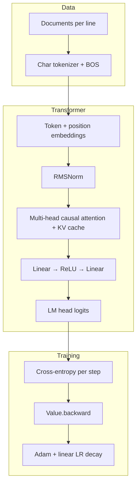
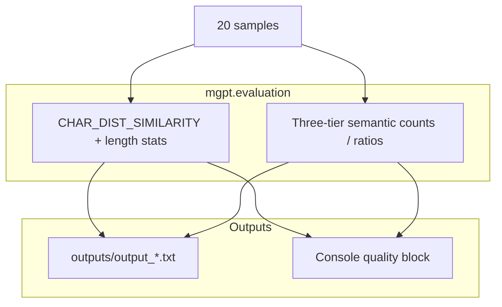

# microGPT

Train a tiny **character-level GPT** in pure Python—no PyTorch, no NumPy, only the standard library. The goal is **understanding**: you can read the autograd (`Value`), the transformer forward pass, Adam, and sampling in one sitting.

**In plain English:** the model learns to predict the **next letter** in each line of a text file (by default, first names). After training, it **rolls weighted dice** to write new lines that resemble the file. Training is **slow on purpose** (every operation is a Python scalar with a visible gradient).

Design lineage: [microGPT / makemore](https://github.com/karpathy/makemore) and [Karpathy’s microGPT write-up](https://karpathy.github.io/2026/02/12/microgpt/).

**There is no `requirements.txt` or `pyproject.toml` on purpose:** only Python 3.

**Jump to:** [Who is this for?](#who-is-this-for) | [Quickstart](QUICKSTART.md) | [Docs index](docs/README.md) | [Run](#quick-start) | [Experiments](#run-experiments-examples) | [Compare reports](#run-reports) | [Configuration](#configuration) | [Architecture](#architecture-high-level)

---

## Who is this for?

> Pick the row that matches you — each links to a **first step**, not the whole README.

| Persona | Start here | What you will do |
|---------|------------|------------------|
| **Learner / student** | [`docs/learn-before-you-code.md`](./docs/learn-before-you-code.md) | Understand tokens, loss, transformers, then read `mgpt/` and [`microgpt.py`](./microgpt.py) |
| **Workshop / playgroup attendee** | [`QUICKSTART.md`](./QUICKSTART.md) → [`docs/experiment-workflow.md`](./docs/experiment-workflow.md) | Run training, manual sweeps, or numbered JSON grid (`experiments/sweep.py`) |
| **Curious explorer** | [`example-experiments/comparison_report.html`](./example-experiments/comparison_report.html) | Browse H4 vs H1 results **without training** |
| **Experimenter** | [`docs/experiment-workflow.md`](./docs/experiment-workflow.md) | Train → `outputs/` → CLI diff, HTML, or grid sweep ranked by quality score |
| **Autograd-focused reader** | [`docs/autograd-deep-dive.md`](./docs/autograd-deep-dive.md) | Diagrams + hand-traced `Value` / `backward()` before [`mgpt/value.py`](./mgpt/value.py) |
| **Contributor / extender** | [`CLAUDE.md`](./CLAUDE.md) | Edit [`microgpt_updated.py`](./microgpt_updated.py) + [`mgpt/`](./mgpt/); report format in [`run_report/`](./run_report/) |

**All docs by topic:** [`docs/README.md`](./docs/README.md)

**Compare tools (quick pick):**

| Goal | Tool |
|------|------|
| Diff **two** runs in the terminal | `compare_run_reports.py` |
| Table of **two or more** runs in a browser | `experiments/report_generator.py` |
| **Grid search** many configs by quality score | `experiments/sweep.py` + JSON under `experiments/configs/` |

---

## Start here (lookup table)

| If you want to… | Read this first |
|-----------------|-----------------|
| **Run something now** | [`QUICKSTART.md`](./QUICKSTART.md) or [Quick start](#quick-start) below |
| **Learn the ideas** before opening code | [`docs/learn-before-you-code.md`](./docs/learn-before-you-code.md) |
| **Understand autograd** | [`docs/autograd-deep-dive.md`](./docs/autograd-deep-dive.md) |
| **Run and compare experiments** | [`docs/experiment-workflow.md`](./docs/experiment-workflow.md) |
| **Grid sweep (automated search)** | [Grid sweep](#grid-sweep-automated-search) · [`experiments/configs/README.md`](./experiments/configs/README.md) |
| **Change settings** | [Configuration](#configuration) · `python microgpt_updated.py --help` |
| **Understand generated-name scoring** | [`docs/M2-semantic-quality.md`](./docs/M2-semantic-quality.md) |
| **Edit code or add features** | [`CLAUDE.md`](./CLAUDE.md) |

Suggested paths:

- **Learn:** learn guide → autograd deep dive (optional) → quick start → example report → code  
- **Experiment:** QUICKSTART → [experiment workflow](./docs/experiment-workflow.md) → compare or HTML

---

## Why this repo exists

- **Readable end-to-end story**: You can read one file and see data → tokens → forward → loss → backward → optimizer → sampling.
- **No PyTorch / NumPy**: Gradients are computed with explicit `Value` nodes and the chain rule, so the mechanics of autograd are visible.
- **Small enough to run locally**: Default settings train in ~1000 steps on a names corpus; generation prints a handful of sampled strings.

Training is **intentionally slow** (scalar ops in Python). That is expected and part of the pedagogical tradeoff.

---

## Requirements

- **Python 3** (the refactored script uses `from __future__ import annotations` and type hints).

---

## Quick start

> **New here?** [`QUICKSTART.md`](./QUICKSTART.md) is the shortest path to a first run. This section adds detail and script choice.

```bash
# Recommended: structured entry with types, Tokeniser, train()/generate()/main()
python microgpt_updated.py

# Same defaults, but override hyperparameters for this run (no file edits)
python microgpt_updated.py --help   # lists all flags
# See [How to use microgpt_updated.py](#how-to-use-microgpt_updatedpy) and [Run experiments examples](#run-experiments-examples)

# Compact “single narrative” script (global state, blog-style layout)
python microgpt.py
```

**What you should see:**

1. Dataset size, vocabulary size, parameter count.
2. Training **loss** per step (one updating line)—loss should generally **decrease** over time.
3. **20 generated lines** (default: name-like strings), then a **sample quality** block (how name-like vs the training file).

**`microgpt_updated.py` only** also writes a **run report** to **`outputs/`** (see [Run reports](#run-reports)). The compact `microgpt.py` prints to the terminal only. CLI flags exist only on the refactored entry.

If `input.txt` is missing, both scripts download the classic names list from the makemore repository.

**No time to train?** Open [`example-experiments/output_L1_E16_H4_B16_S1000_….txt`](./example-experiments/output_L1_E16_H4_B16_S1000_T0p5_seed42_20260424_152649.txt) to see what a finished report looks like.

### How to use microgpt_updated.py

Together, the sections below cover **everything you need** to drive this script:

| Topic | Where |
|--------|--------|
| **Baseline run** (module defaults, no edits) | [Quick start](#quick-start): `python microgpt_updated.py` |
| **All CLI flags** | `python microgpt_updated.py --help` and the [Configuration](#configuration) table (`--n-layer` … `--suite-note`) |
| **Custom data file** | `--input path/to/file.txt` (same one-line-per-document format as `input.txt`) |
| **Source-only knobs** (no CLI yet) | Edit the file for `EPS_ADAM`, `NAMES_URL`, or defaults you want when omitting flags |
| **Reproduce project sweeps** | [Run experiments examples](#run-experiments-examples) (manual CLI) or [Grid sweep](#grid-sweep-automated-search) (JSON configs) |
| **Label runs for HTML tables** | [Configuration](#configuration) example: `--suite-index` / `--suite-total` / `--suite-note` |
| **Diff or aggregate reports** | [Run reports](#run-reports): `compare_run_reports.py`, `experiments/report_generator.py` (both expect paths under **`outputs/`** by convention; defaults use `run_reports_dir`). Config lists **`N_EMBD` → `N_HEAD` → `HEAD_DIM`** (then other keys); **`HEAD_DIM`** is labeled as calculated from the first two. |
| **Automated grid search** | [Grid sweep](#grid-sweep-automated-search): `experiments/sweep.py` ranks runs by heuristic **`OVERALL_QUALITY_SCORE`** (see [`mgpt/quality.py`](./mgpt/quality.py)) |

Illustrative one-offs (not tied to the sweep table):

```bash
python microgpt_updated.py --temperature 0.8 --seed 0
python microgpt_updated.py --input my_corpus.txt --num-steps 500
```

## Run experiments examples

These commands match the **distinct hyperparameter combinations** seen in `outputs/output_L*.txt` run reports from experiments in this project (`L=1`, `E=16`, `B=16`, `T=0.5`, `seed=42`; sweeps varied **`N_HEAD`** and **`NUM_STEPS`** only). Omitted flags use the defaults at the top of `microgpt_updated.py`. (The `outputs/` directory is gitignored; regenerate reports with the lines below from the repo root.)

```bash
# 4 heads, 1000 steps — multi-head baseline (output_L1_E16_H4_B16_S1000_*.txt)
python microgpt_updated.py

# 4 heads, 2000 steps — longer multi-head run (output_L1_E16_H4_B16_S2000_*.txt)
python microgpt_updated.py --num-steps 2000

# 1 head, 1000 steps — single-head baseline (output_L1_E16_H1_B16_S1000_*.txt)
python microgpt_updated.py --n-head 1

# 1 head, 50 steps — short training / ablation (output_L1_E16_H1_B16_S50_*.txt)
python microgpt_updated.py --n-head 1 --num-steps 50

# 1 head, 2000 steps — single-head long run (output_L1_E16_H1_B16_S2000_*.txt)
python microgpt_updated.py --n-head 1 --num-steps 2000
```

Each run writes a new `outputs/output_*.txt` whose stem encodes the effective config (plus a local timestamp). Compare reports with `compare_run_reports.py` or `experiments/report_generator.py` — see **[`docs/experiment-workflow.md`](./docs/experiment-workflow.md)** for a step-by-step recipe. For **checked-in examples** you can browse without training first, see [Example artifacts (preview)](#example-artifacts-preview).

## Grid sweep (automated search)

For **many hyperparameter combinations** ranked by a single quality number, use **`experiments/sweep.py`** with numbered JSON configs in **`experiments/configs/`** (`0_sweep-smoke-test.json` for a quick pipeline check · `1_sweep-minimal.json` … `4_sweep-full.json` for real sweeps).

The platform optimizes **simple heuristic tier scores** (not human ground truth). Scoring rules live in **`mgpt/evaluation.py`**; the overall formula, baseline comparison, and ranking key live in **`mgpt/quality.py`**. You can replace or extend those modules — see **[`docs/M2-semantic-quality.md`](./docs/M2-semantic-quality.md#extending-quality-scoring-yourself)**.

**Reference baseline** (default in configs — H4 @ 1000 steps from `example-experiments/`):

```text
TIER1_REAL_RATIO=0.550000
TIER2_PLAUSIBLE_RATIO=0.450000
TIER3_NONSENSE_RATIO=0.000000
OVERALL_QUALITY_SCORE=0.582500
```

```bash
# List configs in recommended order
python experiments/sweep.py --list-configs

# Preview a sweep (no training)
python experiments/sweep.py --config experiments/configs/1_sweep-minimal.json --dry-run

# Quick end-to-end check (~seconds): 2 runs × 5 steps
python experiments/sweep.py --config experiments/configs/0_sweep-smoke-test.json

# Production minimal sweep (slow): 4 runs × 1000–2000 steps
python experiments/sweep.py --config experiments/configs/1_sweep-minimal.json

# Re-rank saved runs without retraining
python experiments/sweep.py --config experiments/configs/1_sweep-minimal.json --summarize-only
```

Each sweep writes **`sweep_summary.csv`**, per-run **`output_*.txt`** reports, and an optional HTML comparison under **`outputs/sweeps/<order>-<name>/`**. Full recipe: **[`docs/experiment-workflow.md` → Grid sweep](./docs/experiment-workflow.md#grid-sweep-automated-search)** · config index: **[`experiments/configs/README.md`](./experiments/configs/README.md)**.

**Tests** (optional; requires `pytest` installed in your environment):

```bash
python -m pytest tests/ -q
```

---

## Data

| Item | Detail |
|------|--------|
| **Default file** | `input.txt` — **one document per line** (the demo uses one name per line). |
| **Format** | Plain text; empty lines are skipped. Characters not present in the file never appear in the vocabulary. |
| **Fallback** | Scripts can fetch names from `https://raw.githubusercontent.com/karpathy/makemore/988aa59/names.txt` if `input.txt` does not exist. |

**Example file** (three names → three training lines):

```text
emma
liam
noah
```

Each line is wrapped with a **BOS** (beginning-of-sequence) token during training so the model learns where a line starts and stops. See [`docs/learn-before-you-code.md`](./docs/learn-before-you-code.md) for a walkthrough.

Replace `input.txt` with your own line-oriented corpus to change what the model learns. Keep lines shorter than **`BLOCK_SIZE`** (default 16, including BOS), or increase `BLOCK_SIZE` in code / `--block-size` on the CLI.

---

## Repository layout

| Path | Role |
|------|------|
| **`microgpt_updated.py`** | Refactored **entry**: hyperparameters (module constants **or** optional `argparse` CLI), `train()` / `generate()` / `main()`, `save_run_report()`. Imports **`mgpt/`** (model + autograd + data) and **`run_report/`** (report text format). **Prefer this for new features, tests, or structural changes.** |
| **`mgpt/`** | Package: `Value`, tensor ops, transformer step `gpt()`, `load_dataset` / `build_tokeniser`, **`evaluation.py`** (tier heuristics), **`quality.py`** (overall score + baseline compare + sweep ranking), **`experiment.py`** (train/generate API). Stdlib only. |
| **`run_report/`** | Package: parse/compare saved reports (`parse.py`), narrative (`narrative.py`), **`paths.py`** (`DEFAULT_RUN_REPORT_DIR`, **`run_reports_dir(repo_root)`** — shared location for `outputs/`), full report assembly (`builder.py`), **text loss visuals** (`text_loss_plot.py`). Used by the entry script, `annotate_run_reports.py`, `compare_run_reports.py`, and **`experiments/report_generator.py`**. |
| **`experiments/`** | Optional tooling: **`sweep.py`** (numbered JSON grid search under **`configs/`** — `1_sweep-minimal.json` … `4_sweep-full.json`; ranks by `OVERALL_QUALITY_SCORE`), **`report_generator.py`** (HTML comparison). Stdlib only. |
| **`tests/`** | `pytest` suite: evaluation, `run_report` paths, text loss plot helpers, HTML report generator. |
| **`microgpt.py`** | Compact version: one continuous script with module-level state; closest to a “single-file walkthrough.” |
| **`annotate_run_reports.py`** | Utility script: inserts the `--- What this run is ---` narrative into **existing** `output_*.txt` files (default glob: **`outputs/`**; so older runs match the current report format). |
| **`compare_run_reports.py`** | Utility script: compares two saved run reports (parsed config, final loss, ordered inference samples). Exit code `0` if all match, `1` if something differs, `2` on usage or parse errors. |
| **`input.txt`** | Training data (optional if download path runs). |
| **`outputs/`** | Default directory for run reports (`output_*.txt`) and `comparison_report.html`; gitignored. Created automatically on write. |
| **`output_*.txt`** | Optional: written by `microgpt_updated.py` under **`outputs/`** by default; not produced by `microgpt.py`. Names encode hyperparameters and a local `_YYYYMMDD_HHMMSS` suffix (see [Run reports](#run-reports)). |
| **`README.md`** | This overview (architecture, config, run reports). |
| **`QUICKSTART.md`** | **Fastest first run** — Python check, one command, smoke browse of `example-experiments/`. |
| **`docs/README.md`** | **Documentation index** — all guides by persona and task. |
| **`docs/learn-before-you-code.md`** | **Start here for concepts** — plain-language primer with examples before reading code. |
| **`docs/autograd-deep-dive.md`** | **Autograd learning guide** — `Value`, graph, `backward()`, worked examples, diagrams; read before `mgpt/value.py`. |
| **`docs/experiment-workflow.md`** | **Experiment recipe** — train runs, save reports, compare CLI vs HTML; links to `example-experiments/`. |
| **`docs/M2-semantic-quality.md`** | **Sample quality guide** — how generated names are scored (tiers, metrics, commands). |
| **`CLAUDE.md`** | Maintainer / assistant context: conventions, internals, which file to edit. |
| **`AGENTS.md`** | Short pointer to `README.md` / `CLAUDE.md` for agent harnesses. |
| **`example-experiments/`** | Checked-in **sample run reports**, a **`compare_run_reports.py`** transcript, and an **HTML comparison** for the **4-head vs 1-head @ 1000 steps** pair — see [Example artifacts (preview)](#example-artifacts-preview). Your own runs still land in gitignored **`outputs/`**. |

---

## Architecture (high level)

> **Mermaid:** GitHub renders in-browser. **VS Code:** `bierner.markdown-mermaid` (diagram preview) + `bpruitt-goddard.mermaid-markdown-syntax-highlighting` (syntax highlight)—then Markdown preview (`Cmd+Shift+V` / `Ctrl+Shift+V`). **JetBrains** (PyCharm, IntelliJ, …): built into the Markdown plugin—enable Mermaid under Settings → Languages & Frameworks → Markdown.

**Story in one breath:** text lines → character tokens → embeddings + positions → transformer blocks (normalize → attend → MLP) → logits per next character → cross-entropy loss → backward → Adam. After training, sample from the same stack starting at BOS.


```mermaid
flowchart TB
  subgraph data [Data]
    Docs[Documents per line]
    Tok[Char tokenizer + BOS]
  end
  subgraph model [Transformer]
    Emb[Token + position embeddings]
    RMS[RMSNorm]
    Attn[Multi-head causal attention + KV cache]
    MLP[Linear → ReLU → Linear]
    Head[LM head logits]
  end
  subgraph train [Training]
    CE[Cross-entropy per step]
    AG[Value.backward]
    Adam[Adam + linear LR decay]
  end
  Docs --> Tok
  Tok --> Emb
  Emb --> RMS
  RMS --> Attn
  Attn --> MLP
  MLP --> Head
  Head --> CE
  CE --> AG
  AG --> Adam
```

**After training (refactored entry only):** generated strings are scored for corpus similarity and coarse “makes sense” tiers; metrics are printed and embedded in the saved report.


```mermaid
flowchart TB
  S[20 samples]
  subgraph metrics [mgpt.evaluation]
    C[CHAR_DIST_SIMILARITY + length stats]
    T[Three-tier semantic counts / ratios]
  end
  subgraph out [Outputs]
    TXT[outputs/output_*.txt]
    CON[Console quality block]
  end
  S --> C
  S --> T
  C --> TXT
  T --> TXT
  C --> CON
  T --> CON
```

### Block details (GPT-2–like with deliberate simplifications)

| Piece | What it does | Plain-English note |
|-------|----------------|---------------------|
| **Tokenisation** | One token per character + **BOS** | Vocabulary = every character seen in your file, plus BOS. |
| **Embeddings** | `wte` + `wpe`, then **RMSNorm** | “Which letter” vector + “which position” vector, rescaled for stability. |
| **Attention** | Multi-head, **causal**, with **KV cache** | Each new letter may look at earlier letters only; cache avoids recomputing past keys/values when generating. |
| **Residuals** | Pre-norm: norm → sublayer → add input | Standard “don’t lose the old signal” wiring. |
| **MLP** | Widen → **ReLU** → project (full GPT-2 often uses GELU) | Extra non-linear capacity after attention. |
| **LM head** | Linear map to vocabulary logits | Scores for “what letter comes next?” |
| **Biases** | None on linear layers | Matches the reference write-up. |

**Autograd (`Value`):** every number remembers how it was built; `loss.backward()` walks the graph and fills `.grad` via the chain rule—same *idea* as PyTorch, but one scalar at a time so you can read it. Full learning guide with diagrams and worked examples: [`docs/autograd-deep-dive.md`](./docs/autograd-deep-dive.md). Source: [`mgpt/value.py`](./mgpt/value.py).

**Optimisation:** Adam with bias-corrected moments and **learning rate decaying linearly to zero** over the run.

**Inference:** start at BOS → softmax sample → append letter → repeat until BOS or **`BLOCK_SIZE`**. **Temperature** divides logits before softmax: lower = safer/more typical samples; higher = wilder. Example: `--temperature 0.8`.

Concept primer with worked examples: [`docs/learn-before-you-code.md`](./docs/learn-before-you-code.md).

---

## Run reports

After **`microgpt_updated.py`** finishes, it writes a text file under **`outputs/`** (by default). Think of it as a **lab notebook page** for that run.

**Sections (top to bottom):**

| Section | What it tells you |
|---------|-------------------|
| `--- What this run is ---` | Plain-language summary: input file, architecture, steps, how to read loss and samples |
| `--- Experiment suite ---` | Optional labels when you sweep variants (`--suite-index`, etc.) |
| `--- Run timing ---` | Wall-clock start/end in **UTC** and **local time with offset**, plus `DURATION_SECONDS` and `TIMEZONE` |
| `--- Config (this run) ---` | Every hyperparameter; **`N_EMBD` → `N_HEAD` → `HEAD_DIM`** (`HEAD_DIM` is always `N_EMBD // N_HEAD`) |
| Final loss | Last training-step loss (lower = better fit on training objective) |
| Sample quality | Character mix and length vs training data |
| Semantic quality | Three-tier heuristic: real / plausible / nonsense names ([details](./docs/M2-semantic-quality.md)) |
| Loss history CSV | One `step,loss` row per training step—for ASCII plots in compare tools |
| Inference samples | The 20 generated lines |
| Parameter glossary | What each config key and filename token means |

**Technical note:** compare/HTML tools use the same config key order (`run_report.parse._CFG_DISPLAY_ORDER`); parsers derive `HEAD_DIM` in memory.

- **Default path:** **`<microgpt repo>/outputs/`** + filename built from hyperparameters, e.g. `outputs/output_L1_E16_H4_B16_S1000_T0p5_seed42_20260422_153045.txt`. The folder is `run_reports_dir(repo_root)` in `run_report.paths` (i.e. `repo_root / DEFAULT_RUN_REPORT_DIR`), where **repo root** is the directory containing `microgpt_updated.py`. That matches `experiments/report_generator.py` and `annotate_run_reports.py`, so tools find the same files even if your shell cwd is elsewhere. Override with **`--output-dir`** on `microgpt_updated.py` (path is resolved from cwd). The stem encodes `L/E/H/B/S/T/seed` (per-head width is `N_EMBD//N_HEAD` and is not a separate filename token) plus a trailing **`_YYYYMMDD_HHMMSS`** suffix in **local wall-clock time** when the path is built (approximate end; for uniqueness only). **Authoritative** start/end/duration are in `--- Run timing ---` as ISO-8601 **UTC** and **local-with-offset** pairs. In the `T` token, the decimal point is written as `p` (and a leading minus as `m`) so the stem stays token-friendly. See `format_run_output_path()` in `microgpt_updated.py` and `format_run_output_path_for_params()` in `run_report/paths.py`.
- **Past reports:** to add or refresh the narrative on files saved before the narrative existed, run from the repo root:

  ```bash
  python annotate_run_reports.py
  python annotate_run_reports.py outputs/output_L1_....txt
  ```

  The script skips files that already contain `--- What this run is ---`.

### Comparing two reports

Use **`compare_run_reports.py`** when you want a quick diff between runs (e.g. after a hyperparameter sweep or a code change): it prints differences in the **config block** in a fixed order (`N_LAYER`, **`N_EMBD` → `N_HEAD` → `HEAD_DIM`**, then remaining keys). **`HEAD_DIM`** is included and annotated as **calculated from `N_EMBD` and `N_HEAD`**. The tool also diffs the **final training loss** and each **inference sample** line (side-by-side; `*` marks a mismatch). When both reports include `--- Run timing ---`, it prints **start/end (UTC and local) and duration** for each run (informational; does not affect exit code). Narrative text, experiment-suite notes, quality blocks, loss-history CSV, and the parameter glossary are **not** compared as structured fields—only parsed config keys, scalar final loss, and ordered samples drive the exit code.

If **both** reports contain `--- Loss history (CSV: step,loss) ---`, the tool also prints **text graphs**: shared-scale min–mean–max bands per bin, a Δ row between runs, and RMSE / mean |Δ| over binned means (implementation: `run_report/text_loss_plot.py`).

From the repo root:

```bash
python compare_run_reports.py outputs/output_A.txt outputs/output_B.txt
python compare_run_reports.py outputs/output_A.txt outputs/output_B.txt --loss-bins 96 --loss-height 14
```

**Exit codes:** `0` — parsed config, loss, and all sample strings match; `1` — at least one difference; `2` — wrong number of arguments, a path is not a file, or a report could not be parsed (e.g. missing final loss line).

### Example artifacts (preview)

The **[`example-experiments/`](./example-experiments/)** folder holds real artifacts from the **4-head vs 1-head @ 1000 steps** pair in [Run experiments examples](#run-experiments-examples). Open the files directly, or skim the excerpts below.

| File | What it is |
|------|------------|
| [`output_L1_E16_H4_B16_S1000_…152649.txt`](./example-experiments/output_L1_E16_H4_B16_S1000_T0p5_seed42_20260424_152649.txt) | Full run report — **4 heads**, 1000 steps |
| [`output_L1_E16_H1_B16_S1000_…152836.txt`](./example-experiments/output_L1_E16_H1_B16_S1000_T0p5_seed42_20260424_152836.txt) | Full run report — **1 head**, 1000 steps |
| [`compare-output_…152649-and-…152836.txt`](./example-experiments/compare-output_L1_E16_H4_B16_S1000_T0p5_seed42_20260424_152649-and-output_L1_E16_H1_B16_S1000_T0p5_seed42_20260424_152836.txt) | Saved **`compare_run_reports.py`** stdout for those two files |
| [`comparison_report.html`](./example-experiments/comparison_report.html) | **`experiments/report_generator.py`** HTML for the same pair (open in a browser) |

**Run report** (start of the 4-head file; each report also embeds 1000-step loss CSV and a parameter glossary):

```text
microGPT run report
===================
--- What this run is ---
…
Training: … N_HEAD=4 (16 split across 4 heads → 4 per head), trained for 1000 optimizer steps. …
Output: The last-step training loss is 2.649694 … Below, 20 lines are *generated* strings …

--- Config (this run) ---
N_LAYER=1
N_EMBD=16
N_HEAD=4
HEAD_DIM=4
# HEAD_DIM is N_EMBD // N_HEAD (not a separate sweep knob).
…
Final loss (last training step): 2.649694

--- Sample quality (character-level) ---
CHAR_DIST_SIMILARITY=0.715318
…

--- Semantic quality (three-tier) ---
TIER1_REAL_COUNT=11
TIER1_REAL_RATIO=0.550000
…

--- Inference samples ---
Sample  1: kamon
Sample  2: ann
…
Sample 20: anton
```

**CLI compare** (config diff + sample grid; the saved file also includes ASCII loss curves):

```text
--- Config differences ---
  N_HEAD:                                                           A=4  |  B=1
  HEAD_DIM (calculated from N_EMBD and N_HEAD (N_EMBD // N_HEAD)):  A=4  |  B=16

--- Final loss ---
  A: 2.649694
  B: 2.606264

--- Inference samples ---
*  1:  A: kamon   B: keltis
*  2:  A: ann     B: jeylion
…
  14:  A: alerin  B: alerin
…
* 20:  A: anton   B: anyna
```

**HTML comparison** — side-by-side config, quality summary, aligned samples, tier bars, and loss ASCII for both runs. Regenerate the checked-in copy from the repo root:

```bash
python experiments/report_generator.py \
  example-experiments/output_L1_E16_H4_B16_S1000_T0p5_seed42_20260424_152649.txt \
  example-experiments/output_L1_E16_H1_B16_S1000_T0p5_seed42_20260424_152836.txt \
  -o example-experiments/comparison_report.html
```

Your own sweeps still write to gitignored **`outputs/`**; only **`example-experiments/`** is tracked as a fixed reference set.

### HTML comparison (multi-run)

After you have two or more `output_*.txt` files (for example from head-count or `N_EMBD` sweeps), **`experiments/report_generator.py`** builds one HTML page with: **shared vs varying training config** (same key order as `compare_run_reports.py`, including **`HEAD_DIM` after `N_EMBD` and `N_HEAD`**, with a **calculated-field** hint), the **quality summary** table (final loss, tiers, first sample), **aligned inference samples** across all runs when there are 2+ files (with `*` on rows that differ), **loss history text graphs** when reports embed CSV history (one run → single ASCII curve; several → baseline = lowest final loss among runs with history, each other run compared to that baseline; tune with `--loss-bins` / `--loss-height`), and **tier bar charts** for runs that have semantic metrics. Reports **without** a semantic quality block are **legacy**: one collapsed table row plus filenames/losses; tier bars only for modern runs.

```bash
# From anywhere: defaults to outputs/output_*.txt under the repo root; writes outputs/comparison_report.html
python experiments/report_generator.py

# Explicit files and output path
python experiments/report_generator.py run_a/output_L1_....txt run_b/output_L1_....txt -o /tmp/my_comparison.html
python experiments/report_generator.py -o outputs/comparison_report.html

# Loss ASCII resolution (same meaning as compare_run_reports.py)
python experiments/report_generator.py --loss-bins 96 --loss-height 14
```

If you pass no positional arguments, the script globs **`output_*.txt`** under **`run_reports_dir(<repo root>)`** (the parent of `experiments/`, i.e. where `microgpt_updated.py` lives — **not** your shell cwd). Exit `2` if no report files are found or parsing fails; otherwise it prints the path that was written.

---

## Configuration

**`microgpt.py`:** hyperparameters are **only** the constants near the top of the file (no CLI).

**`microgpt_updated.py`:** defaults are the **same module-level constants**; you can override them per run with **optional flags** (stdlib `argparse`). Omitted flags keep the file’s values. Run `python microgpt_updated.py --help` for the full list. `N_EMBD` must remain divisible by `N_HEAD` (head dimension is still `N_EMBD // N_HEAD`).

| CLI flag | Maps to |
|----------|---------|
| `--n-layer` | `N_LAYER` |
| `--n-embd` | `N_EMBD` |
| `--n-head` | `N_HEAD` |
| `--block-size` | `BLOCK_SIZE` |
| `--num-steps` | `NUM_STEPS` |
| `--temperature` | `TEMPERATURE` |
| `--seed` | `SEED` |
| `--learning-rate` | `LEARNING_RATE` |
| `--beta1`, `--beta2` | `BETA1`, `BETA2` |
| `--input` | `INPUT_PATH` |
| `--suite-index`, `--suite-total`, `--suite-note` | `EXPERIMENT_SUITE_*` (only the flags you pass are applied; omit them to keep values set in the file) |
| `--output-dir` | Directory for the saved `output_*.txt` (default: **`<repo>/outputs`**, anchored to the folder containing `microgpt_updated.py`; resolved to an absolute path) |

Example sweep from the shell (labels each report for HTML comparison):

```bash
python microgpt_updated.py --n-head 1 --suite-index 1 --suite-total 2 --suite-note "head-count sweep"
python microgpt_updated.py --n-head 4 --suite-index 2 --suite-total 2 --suite-note "head-count sweep"
```

(`--num-steps` defaults to `1000` here; see [Run experiments examples](#run-experiments-examples) for the full set of `(n_head, num_steps)` pairs used in repo runs.)

### `microgpt_updated.py` (recommended reference)

| Symbol | Default | Unit | Role |
|--------|---------|------|------|
| `N_LAYER` | `1` | layers | Transformer depth |
| `N_EMBD` | `16` | dimensions | Model width / embedding dimension |
| `N_HEAD` | `4` | heads | Attention heads (CLI `--n-head`). |
| `HEAD_DIM` | `N_EMBD // N_HEAD` | dimensions | Per-head width (derived); in source and reports it always **follows** `N_EMBD` and `N_HEAD`. |
| `BLOCK_SIZE` | `16` | tokens | Max context length (positions 0 … `BLOCK_SIZE - 1`) |
| `LEARNING_RATE` | `0.01` | dimensionless | Base Adam step size (scaled by linear decay) |
| `BETA1` | `0.85` | dimensionless | Adam first-moment decay |
| `BETA2` | `0.99` | dimensionless | Adam second-moment decay |
| `EPS_ADAM` | `1e-8` | dimensionless | Adam epsilon |
| `NUM_STEPS` | `1000` | steps | Training steps (one random document per step, modulo dataset size) |
| `TEMPERATURE` | `0.5` | dimensionless | Sampling temperature for generation |
| `SEED` | `42` | dimensionless | RNG seed |
| `NAMES_URL` | makemore `names.txt` | URL | Download URL if `input.txt` missing |
| `INPUT_PATH` | `"input.txt"` | path | Training file path |
| `EXPERIMENT_SUITE_INDEX` | `None` | — | Optional 1-based index of this run in a multi-run sweep (see `EXPERIMENT_SUITE_TOTAL`). |
| `EXPERIMENT_SUITE_TOTAL` | `None` | — | Optional total number of runs; with `EXPERIMENT_SUITE_INDEX` set, the report prints `Experiment: i / n`. |
| `EXPERIMENT_SUITE_NOTE` | `None` | — | Optional one-line description (e.g. what is being swept), shown as `Suite note: …`. The `--- Experiment suite ---` block is omitted only when **all three** of these are `None`. |

### `microgpt.py` (compact script)

Same roles under lowercase names: `n_layer`, `n_embd`, `n_head`, `head_dim` (always `n_embd // n_head`, **after** `n_embd` and `n_head` in the file), `block_size`, `learning_rate`, `beta1`, `beta2`, `eps_adam`, `num_steps`, `temperature`, plus inline `names_url` and `'input.txt'`.

**Practical tips:**

- Increase **`N_EMBD` / `n_embd`** or **`N_LAYER` / `n_layer`** only if you accept much slower training.
- **`BLOCK_SIZE` / `block_size`** must fit your longest line (including BOS on both ends).
- **`TEMPERATURE` / `temperature`**: lower → sharper / more “typical” samples; higher → more diverse.

**Example — compare head counts without editing source:**

```bash
python microgpt_updated.py --n-head 4 --suite-index 1 --suite-total 2 --suite-note "head-count sweep"
python microgpt_updated.py --n-head 1 --suite-index 2 --suite-total 2 --suite-note "head-count sweep"
python compare_run_reports.py outputs/output_….txt outputs/output_….txt
```

---

## Developing further

- **Dependency policy**: Keep the project **stdlib-only** unless maintainers explicitly add third-party packages.
- **Where to edit**: Use **`microgpt_updated.py`** for the training/generation orchestration and **`mgpt/`** for model or autograd internals; keep **`microgpt.py`** aligned with the “one file narrative” when possible. Report layout and parsing live in **`run_report/`**.
- **Run report text**: The human-readable story in `--- What this run is ---` is implemented in **`run_report/narrative.py`** (`format_run_narrative_lines`); `annotate_run_reports.py` imports it so backfilled files match new runs. Config and compare/HTML tables keep **`N_EMBD` → `N_HEAD` → `HEAD_DIM`** (`run_report.parse._CFG_DISPLAY_ORDER`).
- **Comparing reports**: After two runs, `python compare_run_reports.py outputs/output_….txt outputs/output_….txt` summarizes config / loss / sample diffs and optional loss-history text graphs (see [Comparing two reports](#comparing-two-reports)).
- **Batch HTML summaries**: See [HTML comparison (multi-run)](#html-comparison-multi-run).
- **Educational comments**: The refactored file includes explanatory comments; avoid stripping them without an explicit request.
- **KV cache and training**: During training, cached keys/values are part of the live graph for that forward (they are not treated as detached inference-only tensors). Understand this before changing caching behavior.
- **Testing**: From the repo root, run `python -m pytest tests/ -q` (or targeted modules: `test_evaluation`, `test_text_loss_plot`, `test_report_generator`, `test_paths`). See [`docs/M2-semantic-quality.md`](./docs/M2-semantic-quality.md) for the semantic-quality / run-report workstream notes.

For assistant-oriented conventions and file-choice guidance, see **[`CLAUDE.md`](./CLAUDE.md)**.

---

## Further reading

**In this repo**

- [`QUICKSTART.md`](./QUICKSTART.md) — minimal first run
- [`docs/README.md`](./docs/README.md) — documentation index by persona
- [`docs/learn-before-you-code.md`](./docs/learn-before-you-code.md) — concepts and examples before diving into code
- [`docs/autograd-deep-dive.md`](./docs/autograd-deep-dive.md) — autograd: `Value`, graph, backward, worked examples
- [`docs/experiment-workflow.md`](./docs/experiment-workflow.md) — train, compare runs, HTML reports
- [`docs/M2-semantic-quality.md`](./docs/M2-semantic-quality.md) — sample quality tiers and metrics
- [`CLAUDE.md`](./CLAUDE.md) — file layout and conventions for contributors

**External**

- [microGPT — fully deterministic backpropagation through a GPT-2 forward pass](https://karpathy.github.io/2026/02/12/microgpt/) (blog post)
- [karpathy/makemore](https://github.com/karpathy/makemore) (related character-level models and datasets)
