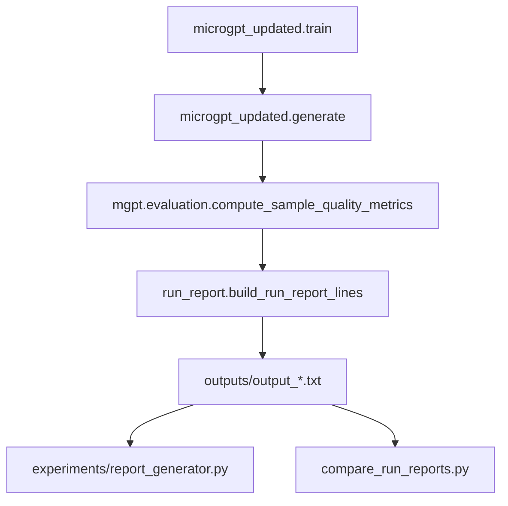

# M2+ Semantic quality (execution log)

Three-tier **heuristic** sample evaluation (training-corpus membership, plausibility score, nonsense flags) plus character-level distribution similarity. Stdlib-only; lives in `mgpt/evaluation.py`.

## Flow (code → artifacts)



## Slices (completed)

| Slice | Outcome |
|-------|---------|
| **1 — `mgpt/evaluation.py`** | `char_distribution_similarity`, `evaluate_sample_quality`, `is_pronounceable`, `score_plausibility`, `classify_plausible_words`, `is_nonsense`, `count_nonsense_words`, `evaluate_semantic_quality`. Max consonant run **4** (English-friendly); `overall_quality_score` clamped to `[0, 1]`. |
| **2 — `run_report`** | `build_run_report_lines(..., char_dist_score=, quality_metrics=, semantic_quality=)`. `ParsedRunReport` extended; `parse_run_report_text` reads `--- Sample quality ---` and `--- Semantic quality ---` blocks, normalizes `HEAD_DIM` from `N_EMBD`/`N_HEAD`, and example comment lines. On-disk **config** lists `N_EMBD` / `N_HEAD` plus a `#` line for derived per-head width (no `HEAD_DIM=` row). |
| **3 — `microgpt_updated.py`** | After `generate()`, prints the SAMPLE QUALITY block and passes metrics into `save_run_report()`. |
| **4 — `experiments/report_generator.py`** | `python experiments/report_generator.py [outputs/output_*.txt ...] -o outputs/comparison_report.html` builds a comparison table and tier bar rows (shared/varying config omits `HEAD_DIM`; a footnote shows derived per-head width; defaults use `run_reports_dir` from repo root). |
| **5 — Tests** | `tests/test_evaluation.py` (pronounce/nonsense, tier extremes, score bounds, builder/parse round-trip). |

## Commands

Full CLI and workflow map: **`README.md`** → *How to use microgpt_updated.py* and *Run experiments examples*.

```bash
# Train, print samples + quality block, write output_*.txt (with loss history + quality sections)
python microgpt_updated.py
python microgpt_updated.py --help

# Tests
python -m pytest tests/test_evaluation.py tests/test_text_loss_plot.py -q
python -m pytest tests/ -q

# HTML: all outputs/output_*.txt at repo root → outputs/comparison_report.html
python experiments/report_generator.py

# HTML: explicit inputs and output path (script adds repo root to sys.path; works from any cwd)
python experiments/report_generator.py path/to/run_a.txt path/to/run_b.txt -o /tmp/cmp.html
python experiments/report_generator.py -o outputs/comparison_report.html

# Diff two reports (primary config keys, loss, samples; HEAD_DIM omitted from config output)
python compare_run_reports.py path/to/A.txt path/to/B.txt
python compare_run_reports.py path/to/A.txt path/to/B.txt --loss-bins 96 --loss-height 14

# Backfill narrative on older reports (unchanged by M2)
python annotate_run_reports.py
python annotate_run_reports.py path/to/output_L1_....txt
```

### Run experiments examples

CLI invocations that reproduce the **distinct `(N_HEAD, NUM_STEPS)` pairs** from saved `output_L*.txt` in this repo (`L=1`, `E=16`, `B=16`, `T=0.5`, `seed=42`). Full flag reference: `python microgpt_updated.py --help`.

```bash
# 4 heads, 1000 steps — multi-head baseline (output_…_H4_…_S1000_….txt)
python microgpt_updated.py

# 4 heads, 2000 steps (output_…_H4_…_S2000_….txt)
python microgpt_updated.py --num-steps 2000

# 1 head, 1000 steps (output_…_H1_…_S1000_….txt)
python microgpt_updated.py --n-head 1


# 1 head, 2000 steps (output_…_H1_…_S2000_….txt)
python microgpt_updated.py --n-head 1 --num-steps 2000
```

Optional suite labels for multi-run HTML tables:

```bash
python microgpt_updated.py --num-steps 500 --temperature 0.7 --suite-index 1 --suite-total 4 --suite-note "temperature sweep"
```

## Notes

- **Reuse**: `compute_sample_quality_metrics` + `format_sample_quality_console_lines` centralize what `microgpt_updated.py` prints and saves; semantic evaluation uses one pass over samples with cached corpus bigrams / average length. Parsed reports set `HEAD_DIM` to `N_EMBD // N_HEAD` in memory. **Compare / HTML** treat `HEAD_DIM` as **derived** (see `run_report.DERIVED_EXPERIMENT_CFG_KEYS`); HTML adds a one-line “derived” note, CLI compare omits it from the printed config diff. Tier/quality table labels still use `n_head` × `head_dim` for a compact “geometry” readout.
- **Tier overlap**: Tier 1 (real), Tier 2 (plausible among **non-real**), and Tier 3 (nonsense on **all** samples) are not mutually exclusive by construction; `distribution_sum` in `evaluate_semantic_quality` is a sanity hint only.
- **Hypothesis testing (N_HEAD × N_EMBD sweeps)**: Compare `OVERALL_QUALITY_SCORE` and tier ratios across `output_*.txt` reports or the HTML summary (per-head width follows from `N_EMBD` and `N_HEAD`).
