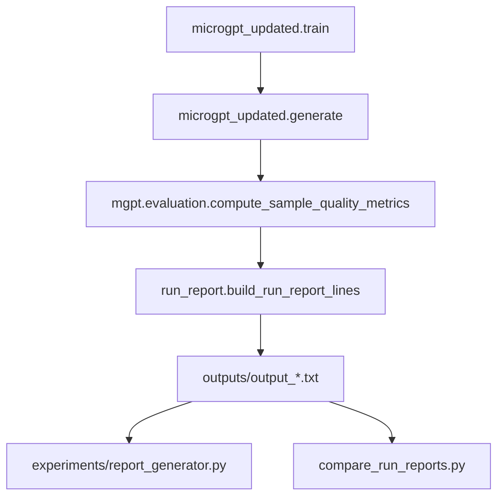

# Sample quality and semantic tiers

**Sample quality guide** — heuristic scoring of generated names after training.

After training, **`microgpt_updated.py`** generates 20 strings and scores them. This page explains **what those scores mean** and how the code fits together. For the big-picture concepts (loss, temperature, attention), start with **[`learn-before-you-code.md`](./learn-before-you-code.md)**. **Navigation:** [`docs/README.md`](./README.md).

---

## Why we score samples at all

Training loss tells you how well the model **fit the training file**. It does **not** tell you whether generated lines **look like names** to a human—or whether they are exact copies vs new plausible strings.

The metrics in `mgpt/evaluation.py` are **cheap heuristics** (stdlib only, no external NLP models). Use them to **compare runs** (e.g. 4 heads vs 1 head), not as absolute “AI quality” scores.

---

## Character-level metrics

These compare the **20 generated lines** to **all lines in the training file**.

| Metric | Meaning | Good direction |
|--------|---------|----------------|
| **`CHAR_DIST_SIMILARITY`** | Do generated letters use a similar mix of `a`, `e`, `n`, … as the corpus? | Closer to **1.0** |
| **`AVG_SAMPLE_LENGTH`** | Average length of a generated line (characters) | Compare to training names |
| **`LENGTH_SIMILARITY`** | How close that average is to the corpus average length | Closer to **1.0** |

**Example:** if training names average ~5 letters and generations average ~5, length similarity is high. If the model emits mostly single letters, length similarity drops.

Implementation: `char_distribution_similarity()` and `evaluate_sample_quality()` in `mgpt/evaluation.py`.

---

## Three semantic tiers (heuristic)

Each generated line is classified with **simple rules**, not a dictionary or LLM judge.

### Tier 1 — Real (in training data)

**Rule:** the line matches a training line exactly (case-insensitive, trimmed).

| Generated | Training file contains | Tier 1? |
|-----------|------------------------|---------|
| `ann` | `ann` | Yes |
| `Anna` | `anna` | Yes (case ignored) |
| `kamon` | not in file | No |

**Report fields:** `TIER1_REAL_COUNT`, `TIER1_REAL_RATIO`, commented `# Tier 1 Examples`.

High Tier 1 can mean the model **memorized** common names—or that your corpus is small and random sampling hits often.

### Tier 2 — Plausible (not real, but name-like)

**Rule:** not Tier 1, but a **plausibility score ≥ 0.6** built from:

1. **Pronounceable** — has vowels, no huge consonant runs, no absurd letter triples, no impossible starts like `zx…`.
2. **Length** — not wildly longer/shorter than average training name length.
3. **Bigrams** — pairs of letters (`"an"`, `"em"`, …) overlap with pairs seen in the training corpus.

| Generated | Typical outcome |
|-----------|-----------------|
| `karia` | Often Tier 2 — looks like a name, not in file |
| `vialan` | Often Tier 2 |
| `emma` | Tier 1 if `emma` is in the file; otherwise maybe Tier 2 |

**Report fields:** `TIER2_PLAUSIBLE_COUNT`, `TIER2_PLAUSIBLE_RATIO`, `TIER2_AVG_SCORE`, examples.

### Tier 3 — Nonsense

**Rule:** fails basic “word shape” checks—too short, all vowels, no vowels, all same letter, or not pronounceable.

| Generated | Why nonsense |
|-----------|----------------|
| `zxqx` | Impossible consonant clusters / starts |
| `aaaa` | Repeated single character |
| `b` | Too short |

**Report fields:** `TIER3_NONSENSE_COUNT`, `TIER3_NONSENSE_RATIO`, examples.

### Overall score

`OVERALL_QUALITY_SCORE` combines tier ratios (real × 1.0, plausible × 0.7, non-nonsense × 0.3) into one number in **[0, 1]**. Use it to **rank runs**, not as ground truth.

**Note:** tiers are **not strictly disjoint** in every edge case; `distribution_sum` in code is a sanity hint only.

### Worked example (checked-in report)

From **`example-experiments/output_L1_E16_H4_B16_S1000_….txt`** (4 heads, 1000 steps):

```text
TIER1_REAL_RATIO=0.550000      # 11/20 exact training names
TIER2_PLAUSIBLE_RATIO=0.450000 # 9/20 new but plausible
TIER3_NONSENSE_RATIO=0.000000  # none obviously broken
OVERALL_QUALITY_SCORE=0.582500
# Tier 1 Examples: kamon, ann, karai, …
# Tier 2 Examples: vialan, karia, yeran, …
```

Compare with the **1-head** report in the same folder to see how architecture changes samples and tiers.

---

## Where the numbers flow (code → files)


```mermaid
flowchart TB
  Train[microgpt_updated.train]
  Gen[microgpt_updated.generate]
  Eval[mgpt.evaluation.compute_sample_quality_metrics]
  Report[run_report.build_run_report_lines]
  Disk[outputs/output_*.txt]
  HTML[experiments/report_generator.py]
  Cmp[compare_run_reports.py]
  Train --> Gen
  Gen --> Eval
  Eval --> Report
  Report --> Disk
  Disk --> HTML
  Disk --> Cmp
```

| Step | Module | What happens |
|------|--------|----------------|
| 1 | `microgpt_updated.py` | Train, then `generate()` → 20 samples |
| 2 | `mgpt/evaluation.py` | `compute_sample_quality_metrics()` → char + semantic dicts |
| 3 | `run_report/builder.py` | Embeds metrics in `output_*.txt`; config order **`N_EMBD` → `N_HEAD` → `HEAD_DIM`** |
| 4 | `experiments/report_generator.py` | HTML table + tier bars |
| 5 | `compare_run_reports.py` | Diff config, loss, samples (not quality blocks for exit code) |

---

## Commands

Full CLI and workflow map: **`README.md`** → *How to use microgpt_updated.py* and *Run experiments examples*. Step-by-step train/compare recipe: **[`experiment-workflow.md`](./experiment-workflow.md)**.

```bash
# Train, print samples + quality block, write output_*.txt
python microgpt_updated.py
python microgpt_updated.py --help

# Tests
python -m pytest tests/test_evaluation.py tests/test_text_loss_plot.py -q
python -m pytest tests/ -q

# HTML: all outputs/output_*.txt → outputs/comparison_report.html
python experiments/report_generator.py

# HTML: explicit inputs
python experiments/report_generator.py path/to/run_a.txt path/to/run_b.txt -o /tmp/cmp.html

# Diff two reports (config, loss, samples; optional loss ASCII)
python compare_run_reports.py path/to/A.txt path/to/B.txt
python compare_run_reports.py path/to/A.txt path/to/B.txt --loss-bins 96 --loss-height 14

# Backfill narrative on older reports
python annotate_run_reports.py
python annotate_run_reports.py path/to/output_L1_....txt
```

### Run experiments examples

Reproduce the **distinct `(N_HEAD, NUM_STEPS)` pairs** used in this repo (`L=1`, `E=16`, `B=16`, `T=0.5`, `seed=42`):

```bash
python microgpt_updated.py                                    # H4, 1000 steps
python microgpt_updated.py --num-steps 2000                 # H4, 2000 steps
python microgpt_updated.py --n-head 1                       # H1, 1000 steps
python microgpt_updated.py --n-head 1 --num-steps 50        # H1, short ablation
python microgpt_updated.py --n-head 1 --num-steps 2000      # H1, 2000 steps
```

Optional suite labels for HTML tables:

```bash
python microgpt_updated.py --num-steps 500 --temperature 0.7 \
  --suite-index 1 --suite-total 4 --suite-note "temperature sweep"
```

---

## Implementation slices (completed)

| Slice | Outcome |
|-------|---------|
| **1 — `mgpt/evaluation.py`** | Character similarity, length stats, pronounceability, plausibility, three-tier semantic summary. Max consonant run **4**; `overall_quality_score` clamped to `[0, 1]`. |
| **2 — `run_report`** | Quality blocks in reports; `ParsedRunReport` extended; config order **`N_EMBD` → `N_HEAD` → `HEAD_DIM`**. |
| **3 — `microgpt_updated.py`** | Console SAMPLE QUALITY block + `save_run_report()`. |
| **4 — `experiments/report_generator.py`** | HTML comparison with tier bars. |
| **5 — Tests** | `test_evaluation`, `test_text_loss_plot`, `test_report_generator`, `test_paths`. |

---

## Notes for experimenters

- **Checked-in examples:** **`example-experiments/`** — H4 vs H1 @ 1000 steps (reports, CLI diff, HTML). See README *Example artifacts (preview)*.
- **Compare / HTML** list `HEAD_DIM` after `N_EMBD` and `N_HEAD` and label it as calculated (`N_EMBD // N_HEAD`).
- **Hypothesis testing (e.g. `N_HEAD` × `NUM_STEPS`):** compare `OVERALL_QUALITY_SCORE`, tier ratios, and sample lines across `outputs/output_*.txt` or the HTML summary—not training loss alone.
