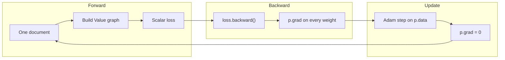
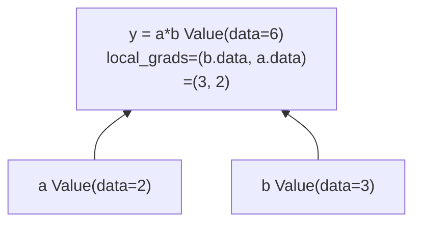
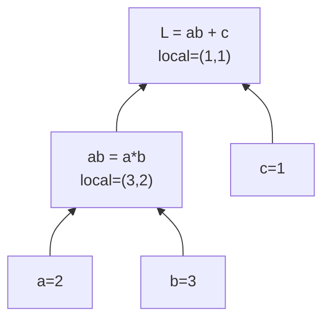
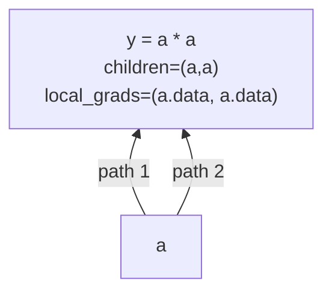
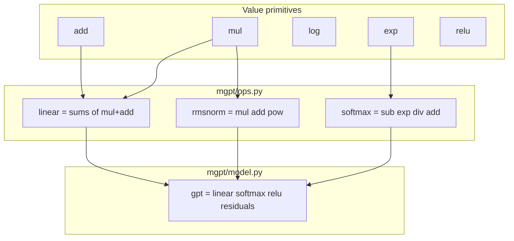
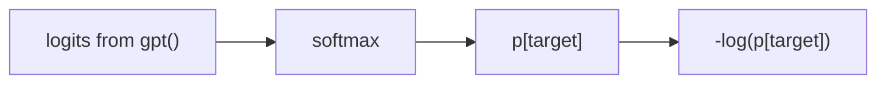
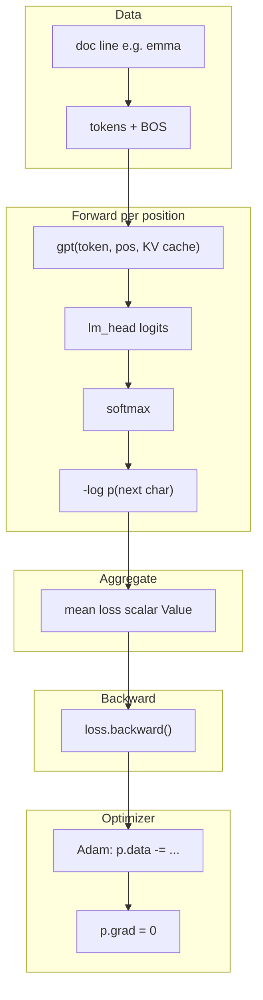
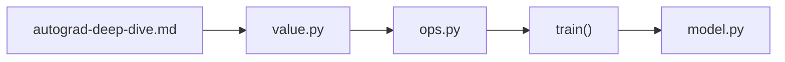
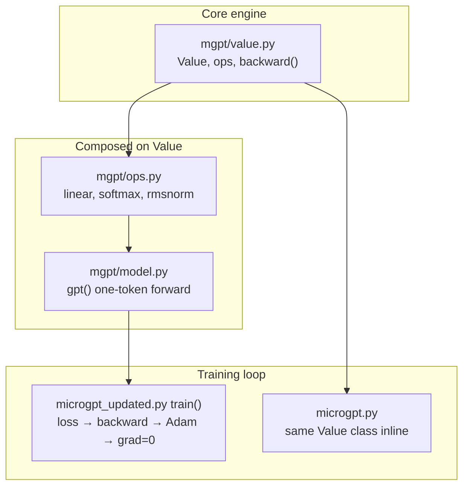

# Autograd deep dive

How **automatic differentiation** works in microgpt: the `Value` class, the computation graph, `backward()`, and where it all connects to training.

**Prerequisites:** skim [`learn-before-you-code.md`](./learn-before-you-code.md) for the big picture (loss, tokens, training loop). **Navigation:** [`docs/README.md`](./README.md).

**Read this doc** before [`mgpt/value.py`](../mgpt/value.py) if autograd is new; read **alongside** the file if you learn by doing.

**Suggested path:** this page → `value.py` → `ops.py` → `train()` in `microgpt_updated.py` → `model.py` → [Karpathy's microGPT blog](https://karpathy.github.io/2026/02/12/microgpt/) for theory.

---

## 1. The problem autograd solves

Training needs an answer to: *"If I nudge this weight a tiny bit, does loss go up or down?"* — for **every** weight. There are thousands of scalar weights in even this tiny model. Hand-derived formulas for each one do not scale.

**Analogy — GPS for downhill hiking:**

| Concept | Role |
|---------|------|
| **Loss** | Your altitude (lower is better) |
| **Gradient** | Which direction is steepest **uphill** |
| **Optimizer (Adam)** | Take a step in the **opposite** direction |

Autograd computes the gradient automatically from the forward computation.



---

## 2. `Value`: one number and its history

Every scalar in the model is a **`Value`** object. It stores four things that matter:

| Field | Meaning | Set when |
|-------|---------|----------|
| `.data` | Forward result (the number itself) | Forward pass |
| `._children` | Input nodes that built this node | Forward pass |
| `._local_grads` | ∂(this)/∂(each child) — local sensitivity | Forward pass |
| `.grad` | ∂(loss)/∂(this) — global gradient | Backward pass |

**Analogy — recipe card:** Each `Value` is one step in a recipe. It records the result, which ingredients went in, and how sensitive the result is to each ingredient. `backward()` walks the recipe in reverse.

**Diagram — one multiply node:**



Implementation: [`mgpt/value.py`](../mgpt/value.py).

---

## 3. Worked example: `y = a * b`

This matches `Value.__mul__` exactly.

**Setup:**

```text
a = Value(2.0)   # leaf / parameter
b = Value(3.0)   # leaf / parameter
y = a * b        # y.data = 6
                 # y._local_grads = (b.data, a.data) = (3.0, 2.0)
```

**Backward trace** (treat `y` as the loss):

| Step | Node | Action | Result |
|------|------|--------|--------|
| 1 | y | `y.grad = 1` | y.grad = 1 |
| 2 | a | `a.grad += 3.0 * 1` | a.grad = **3** (= ∂y/∂a = b) |
| 3 | b | `b.grad += 2.0 * 1` | b.grad = **2** (= ∂y/∂b = a) |

**Learning check:** If `a=2, b=3`, then `y=6`. Increasing `a` by 0.01 increases `y` by about 0.03 (= `b`). That is why the local grad for `a` is `b.data`.

**Mini exercise:** What are `a.grad` and `b.grad` for `y = a * b` when `a=4, b=5`?

<details>
<summary>Answer</summary>

`a.grad = 5`, `b.grad = 4` (product rule: ∂(ab)/∂a = b, ∂(ab)/∂b = a).

</details>

---

## 4. Chain rule: `L = (a * b) + c`

**Setup:**

```text
a=2, b=3  →  ab=6  (local grads 3, 2)
c=1       →  L=7    (local grads 1, 1 for ab and c)
```



**Backward table:**

| Node | Propagation | Grad |
|------|-------------|------|
| L | seed | L.grad = 1 |
| ab | `1 * 1` | ab.grad = 1 |
| c | `1 * 1` | c.grad = 1 |
| a | `3 * ab.grad` | a.grad = 3 |
| b | `2 * ab.grad` | b.grad = 2 |

### Why `+=` matters: `y = a * a`

The same child can appear twice. Gradients from each path must be **summed** (multivariable chain rule):

```text
y = a * a   # children=(a, a), local_grads=(a.data, a.data)
# backward: a.grad += a.data * y.grad + a.data * y.grad  →  2 * a * y.grad
```



This is why [`mgpt/value.py`](../mgpt/value.py) uses `child.grad += local_grad * node.grad`, not `=`.

---

## 5. Operation reference

Every op in `Value` records its local gradients during the forward pass. There is **no separate backward function per op** — only the generic `backward()` walker.

| Op | Forward | Local grad(s) | Intuition |
|----|---------|---------------|-----------|
| `+` | `a+b` | `1, 1` | Output moves 1:1 with either input |
| `*` | `a*b` | `b, a` | Product rule |
| `**n` | `a**n` | `n*a**(n-1)` | Power rule |
| `log` | `log(a)` | `1/a` | |
| `exp` | `exp(a)` | `exp(a)` | derivative of exp is exp |
| `relu` | `max(0,a)` | `1 if a>0 else 0` | flat or slope-1 |
| `-`, `-`, `/` | desugared | via above | `__sub__` → `+` and `neg`; `/` → `*` and `**-1` |

**How primitives stack into the network:**



**Learning note:** There is no `softmax.backward()`. Softmax is built from `Value` ops during forward; `loss.backward()` discovers the correct gradients automatically.

Higher-level ops live in [`mgpt/ops.py`](../mgpt/ops.py): `linear`, `softmax`, `rmsnorm`, `make_matrix`.

---

## 6. Softmax and cross-entropy

The training loop ([`microgpt_updated.py`](../microgpt_updated.py) `train()`, ~383–394) computes loss like this:

```text
probs = softmax(logits)
loss_at_pos = -log(probs[target_id])
loss = mean(loss_at_pos over positions)
```

**Plain English:**

- **Softmax** turns raw logits into probabilities (positive, sum to 1).
- **`-log(p_correct)`** is high when the model is surprised — it assigned low probability to the true next character.



**Numeric toy example** (3-way vocab):

```text
logits = [1.0, 2.0, 0.5]  →  softmax ≈ [0.21, 0.57, 0.12]
target = 1 (middle token)
loss = -log(0.57) ≈ 0.56
```

After `loss.backward()`, every logit and every weight that influenced it gets a `.grad` telling Adam how to increase `p[target]` next time.

---

## 7. One training step end-to-end



**Three things worth noticing in the code:**

1. **KV cache** — Keys and values are appended as live `Value` lists during forward ([`mgpt/model.py`](../mgpt/model.py) lines 76–77). Gradients flow through past timesteps; this is not a detached inference-only cache during training.

2. **Residual connections** — `x = [a + b for a, b in zip(x, x_residual)]` gives gradient shortcuts that help deeper models train ([`model.py`](../mgpt/model.py) lines 111–113).

3. **`p.grad = 0.0`** after each step ([`microgpt_updated.py`](../microgpt_updated.py) ~414–418) — same role as `optimizer.zero_grad()` in PyTorch. Required because `backward()` uses `+=`; stale gradients would mix two unrelated graphs.

**microgpt vs PyTorch (mental model):**

| Idea | PyTorch | microgpt |
|------|---------|----------|
| Scalar/tensor element | `torch.Tensor` | `Value` (scalar) |
| Graph | Built on ops | Built on ops |
| Backward | `loss.backward()` | `loss.backward()` |
| Grad reset | `zero_grad()` | `p.grad = 0.0` |
| Parameters | `nn.Parameter` | `Value` in weight matrices |

Core backward implementation:

```python
# mgpt/value.py — simplified
self.grad = 1.0
for node in reversed(topo):
    for child, local_grad in zip(node._children, node._local_grads):
        child.grad += local_grad * node.grad
```

---

## 8. Code map — where to read next

| Order | File | Focus |
|-------|------|-------|
| 1 | [`mgpt/value.py`](../mgpt/value.py) | `Value`, all ops, `backward()` (~150 lines) |
| 2 | [`mgpt/ops.py`](../mgpt/ops.py) | `linear`, `softmax`, `rmsnorm` |
| 3 | [`microgpt_updated.py`](../microgpt_updated.py) `train()` | loss, `backward()`, Adam, grad zero |
| 4 | [`mgpt/model.py`](../mgpt/model.py) | Full forward graph (`gpt()`) |
| 5 | [`microgpt.py`](../microgpt.py) | Same `Value` class inline; one-file narrative |



**Full stack (code dependencies):**



---

## 9. Common confusions

**Why scalar autograd if it is slow?**  
So every op is visible in plain Python. Pedagogical tradeoff: clarity over speed.

**Why not implement `softmax.backward()` separately?**  
Composition over duplication. One generic `backward()` handles everything built from `Value` ops.

**Why does loss start around 3.3?**  
Random guessing over ~27 tokens (names vocab + BOS): `-log(1/27) ≈ 3.3`. See comments in `train()`.

**Does generation use backward?**  
No. Inference runs forward only; `.grad` is unused when sampling names.

**Where is the "full" autograd?**  
Same algorithm PyTorch uses, at scalar granularity. See the `Value` docstring in [`mgpt/value.py`](../mgpt/value.py).

**Why is there no long autograd doc until now?**  
The project follows the Karpathy microGPT style: the source **is** the lesson. This page adds diagrams and hand-traced examples so you can read the code with confidence.

---

## 10. Glossary

| Term | Definition |
|------|------------|
| **Forward pass** | Compute `.data` and record the graph (`_children`, `_local_grads`) |
| **Backward pass** | Propagate `.grad` from loss to every node |
| **Local gradient** | ∂(output)/∂(input) for one operation |
| **Chain rule** | Multiply gradients along a path from loss to parameter |
| **Leaf / parameter** | A `Value` with no parents (typically a weight in a matrix) |
| **Topological order** | Process nodes so all children are visited before their parent in backward |
| **Computation graph** | DAG of `Value` nodes linked by `_children` |

---

## Further reading

- [`learn-before-you-code.md`](./learn-before-you-code.md) — tokens, loss, temperature, sample quality
- [`experiment-workflow.md`](./experiment-workflow.md) — train runs and compare reports
- [`M2-semantic-quality.md`](./M2-semantic-quality.md) — how generated names are scored (separate from autograd)
- [Karpathy microGPT blog](https://karpathy.github.io/2026/02/12/microgpt/) — theory and motivation
