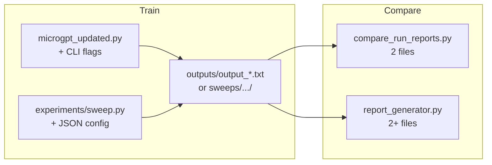

# Experiment workflow

One linear guide: **train runs → save reports → compare results**.

**Navigation:** [`docs/README.md`](./README.md) · [`QUICKSTART.md`](../QUICKSTART.md) · [`README.md`](../README.md)  
**Related:** [concepts](./learn-before-you-code.md) · [autograd](./autograd-deep-dive.md) · [quality tiers](./M2-semantic-quality.md) · [sweep configs](../experiments/configs/README.md)

---

## What you are doing

Each training run produces a **run report** (`outputs/output_*.txt`): config, final loss, 20 generated lines, and quality metrics. Experiments are just **multiple runs with different settings**, then **diff or tabulate** the reports.

**No time to train?** Skip to [Compare without training](#compare-without-training) using checked-in files in [`example-experiments/`](../example-experiments/).

---

## End-to-end flow



| Step | Action | Output |
|------|--------|--------|
| 1 | Run training with desired flags | `outputs/output_L…_YYYYMMDD_HHMMSS.txt` |
| 2 | Repeat with changed flags (e.g. `--n-head 1`) | Another report (timestamp prevents overwrite) |
| 3a | Diff **two** reports | Terminal diff + optional loss ASCII |
| 3b | Summarize **many** reports | `comparison_report.html` in browser |

Reports land in **`outputs/`** (gitignored). Demo artifacts live in **`example-experiments/`** (tracked).

---

## Quick recipe: head-count comparison

Compare **4 heads vs 1 head** at 1000 steps (same seed and data as project defaults):

```bash
# From repo root — each run takes a while (scalar autograd)
python microgpt_updated.py
python microgpt_updated.py --n-head 1

# Diff the two newest reports (adjust paths to your timestamps)
python compare_run_reports.py \
  outputs/output_L1_E16_H4_B16_S1000_T0p5_seed42_*.txt \
  outputs/output_L1_E16_H1_B16_S1000_T0p5_seed42_*.txt

# Or build HTML (explicit paths or glob under outputs/)
python experiments/report_generator.py \
  outputs/output_L1_E16_H4_B16_S1000_T0p5_seed42_*.txt \
  outputs/output_L1_E16_H1_B16_S1000_T0p5_seed42_*.txt \
  -o outputs/comparison_report.html
```

**What to look at:**

| In the report / compare output | Meaning |
|--------------------------------|---------|
| Final loss | Training fit (lower = better on training objective) |
| Inference samples | Side-by-side generated names (`*` = differ) |
| `TIER1_REAL_RATIO` etc. | Heuristic name quality ([details](./M2-semantic-quality.md)) |
| Loss history ASCII | Learning curve shape (when both reports include CSV) |
| **`--- Run timing ---`** / compare timing section | Authoritative wall clock: UTC + local ISO start/end, duration, timezone |
| Filename `_YYYYMMDD_HHMMSS` | Approximate local time for uniqueness only — use **`--- Run timing ---`** for real timestamps |

---

## Canonical sweep commands

These match the **distinct `(N_HEAD, NUM_STEPS)` pairs** used in this repo (`L=1`, `E=16`, `B=16`, `T=0.5`, `seed=42`):

```bash
python microgpt_updated.py                                    # H4, 1000 steps
python microgpt_updated.py --num-steps 2000                   # H4, 2000 steps
python microgpt_updated.py --n-head 1                         # H1, 1000 steps
python microgpt_updated.py --n-head 1 --num-steps 50          # H1, short ablation
python microgpt_updated.py --n-head 1 --num-steps 2000        # H1, 2000 steps
```

Full flag reference: `python microgpt_updated.py --help` and [README Configuration](../README.md#configuration).

---

## Label runs for HTML tables (optional)

When sweeping several variants, tag each run so the HTML report groups them:

```bash
python microgpt_updated.py --n-head 1 \
  --suite-index 1 --suite-total 2 --suite-note "head-count sweep"
python microgpt_updated.py --n-head 4 \
  --suite-index 2 --suite-total 2 --suite-note "head-count sweep"
python experiments/report_generator.py -o outputs/comparison_report.html
```

---

## Grid sweep (automated search)

For systematic hyperparameter search ranked by **`OVERALL_QUALITY_SCORE`**, use **`experiments/sweep.py`** with a numbered JSON config under **`experiments/configs/`**. Files are prefixed **`0_` … `4_`** so run order is obvious; see [`experiments/configs/README.md`](../experiments/configs/README.md).

**Baseline** (default in the example configs — H4 @ 1000 steps):

```text
TIER1_REAL_RATIO=0.550000
TIER2_PLAUSIBLE_RATIO=0.450000
TIER3_NONSENSE_RATIO=0.000000
OVERALL_QUALITY_SCORE=0.582500
```

Each run prints tier deltas vs that baseline; the sweep ends with a ranked table, **`sweep_summary.csv`** (includes per-run UTC/local start/end and duration), and **`sweep_timing.txt`** (whole-grid wall clock) in the config’s `output_dir` (e.g. `outputs/sweeps/1-minimal/`).

```bash
# List configs in recommended order
python experiments/sweep.py --list-configs

# Quick pipeline check (~seconds): 2 runs × 5 steps
python experiments/sweep.py --config experiments/configs/0_sweep-smoke-test.json

# Step 1 — preview then run (4 runs: n_head x num_steps; slow)
python experiments/sweep.py --config experiments/configs/1_sweep-minimal.json --dry-run
python experiments/sweep.py --config experiments/configs/1_sweep-minimal.json

# Re-rank without retraining
python experiments/sweep.py --config experiments/configs/1_sweep-minimal.json --summarize-only

# Optional HTML after sweep
python experiments/sweep.py --config experiments/configs/1_sweep-minimal.json --summarize-only --html
```

| Order | Config | Grid focus | ~Runs |
|------:|--------|------------|------:|
| 0 | `0_sweep-smoke-test.json` | `n_head` × 5 steps (pipeline check) | 2 |
| 1 | `1_sweep-minimal.json` | `n_head` × `num_steps` | 4 |
| 2 | `2_sweep-arch.json` | `n_layer` × `n_embd` × `n_head` | 12 |
| 3 | `3_sweep-arch-steps.json` | arch + `num_steps` | 6 |
| 4 | `4_sweep-full.json` | steps + `temperature` + `learning_rate` | 18 |

Run configs in order when learning the tool. Use **`--max-runs N`** on larger grids. **`HEAD_DIM`** is never swept (derived from `n_embd` and `n_head`). Console progress shows sweep **`elapsed … | ETA …`** alongside the current run index.

**What the sweep optimizes:** simple heuristic tier scores (not ground-truth name quality). Computation lives in **`mgpt/evaluation.py`**; the overall formula, baseline compare, and ranking key live in **`mgpt/quality.py`**. To plug in better metrics, extend those modules — see **[M2-semantic-quality.md → Extending quality scoring](./M2-semantic-quality.md#extending-quality-scoring-yourself)**.

### Example: finished `1_sweep-minimal.json` run

Real output from **`python experiments/sweep.py --config experiments/configs/1_sweep-minimal.json`** (4 runs, ~13 minutes wall clock). Checked-in artifacts: [`example-experiments/sweep-1-minimal/`](../example-experiments/sweep-1-minimal/) (`sweep_summary.csv`, `sweep_timing.txt`).

**Start** — sweep banner, baseline reference, first grid point:

```text
Sweep: minimal
Output: outputs/sweeps/1-minimal
Valid runs: 4
Baseline OVERALL=0.5825 (T1=0.55 T2=0.45 T3=0.00)

--- Run 1 / 4 --- (elapsed 0.0s | ETA —)
Config: ['--n-head', '1']
Num Docs: 32033
Vocab Size: 27
Num Params: 4192
Step    1 / 1000 | Loss 3.3663 | elapsed 0.1s | ETA 1m 6s
…
```

**During training** — in an interactive terminal, one carriage-return line updates in place (`Step … | Loss … | elapsed … | ETA …`; `Avg-100` appears after step 100). Redirecting stdout to a file (e.g. `> output.txt`) preserves every step on its own line because `\r` overwrites do not apply to a log file.

**After each run** — inference samples, quality block, saved report path, delta vs baseline:

```text
OVERALL QUALITY SCORE: 0.552
Saved run report to outputs/sweeps/1-minimal/output_L1_E16_H4_B16_S2000_T0p5_seed42_….txt
Run wall clock: 4m 17s
  OVERALL 0.5525 (-0.0300 vs baseline 0.5825) ✗
  TIER1 0.3500 (-0.2000) | TIER2 0.6500 (+0.2000) | TIER3 0.0000 (+0.0000)
Sweep progress: elapsed 12m 49s | ETA 0s
```

**End** — ranked table and artifact paths:

```text
========================================================================
SWEEP RANKING (by overall_quality_score)
========================================================================
Rank  OVERALL   Δ base    SEC      N_HEAD  STEPS   report
---------------------------------------------------------
1     0.5825    +0.0000    130.1    4       1000    output_L1_E16_H4_B16_S1000_….txt
2     0.5600    -0.0225    125.3    1       1000    output_L1_E16_H1_B16_S1000_….txt
3     0.5525    -0.0300    256.5    4       2000    output_L1_E16_H4_B16_S2000_….txt
4     0.5375    -0.0450    256.5    1       2000    output_L1_E16_H1_B16_S2000_….txt

Best: (defaults)  (OVERALL 0.5825, +0.0000 vs baseline 0.5825)
Summary CSV: outputs/sweeps/1-minimal/sweep_summary.csv
Sweep timing: outputs/sweeps/1-minimal/sweep_timing.txt
Sweep wall clock: 12m 49s
```

Takeaway for this grid: **H4 @ 1000 steps** wins on the heuristic score; doubling steps did not beat it. Each `output_*.txt` under the sweep folder includes **`--- Run timing ---`** (authoritative per-run wall clock).

---

## Run timing and progress

Training and sweeps are slow (scalar autograd in Python). The tooling records **wall-clock time** at three levels:

| Level | Where | What you get |
|-------|--------|--------------|
| **Live progress** | Terminal during training/sweep | `elapsed … \| ETA …` on the updating line (padded so ETA is not clipped) |
| **Per run** | `--- Run timing ---` in each `output_*.txt` | UTC + local ISO start/end, `DURATION_SECONDS`, `TIMEZONE` |
| **Per sweep** | `sweep_summary.csv` + `sweep_timing.txt` | Per-run timing columns in CSV; whole-grid start/end/duration in `sweep_timing.txt` |
| **Compare / HTML** | `compare_run_reports.py`, `report_generator.py` | Timing printed or tabulated when reports include the block |

**Policy:** filename `_YYYYMMDD_HHMMSS` suffixes are for **uniqueness** (approximate local time when the path is built). **`--- Run timing ---`** is **authoritative** for start, end, duration, and timezone. Legacy reports without that block may show a filename-derived hint in compare/HTML only.

Implementation: **`run_report/timing.py`** · wired through **`mgpt/experiment.py`** and **`experiments/sweep.py`**.

---

## Which compare tool?

| Tool | Best for | Input | Output |
|------|----------|-------|--------|
| **`compare_run_reports.py`** | Exact A vs B diff in the terminal | Exactly **2** report paths | Config diff, loss, samples, optional run timing display, optional loss ASCII; exit `0`/`1`/`2` (timing not in exit code) |
| **`experiments/report_generator.py`** | Side-by-side table for **2+** runs | Report paths or default glob `outputs/output_*.txt` | Single **HTML** page: config, quality, timing columns, samples, tier bars, loss graphs |

**Rule of thumb:** use the CLI diff for a quick pairwise check; use HTML when you have a sweep or want tier bars and aligned sample grids.

```bash
# CLI — two files only
python compare_run_reports.py outputs/run_a.txt outputs/run_b.txt

# HTML — all reports under outputs/ (or pass explicit paths)
python experiments/report_generator.py
python experiments/report_generator.py path/a.txt path/b.txt -o /tmp/cmp.html
```

Compare tools **ignore** narrative, quality blocks, loss history, and timing for **equality checks** (CLI exit code); they still **display** quality in HTML and **print/show timing** when present. See [README Run reports](../README.md#run-reports).

---

## Compare without training

Open these checked-in artifacts from [`example-experiments/`](../example-experiments/) (saved **before** the **`--- Run timing ---`** block — compare/HTML show config, loss, and samples; timing columns stay empty or use filename hints):

| File | Purpose |
|------|---------|
| `output_L1_E16_H4_B16_S1000_….txt` | 4-head run report |
| `output_L1_E16_H1_B16_S1000_….txt` | 1-head run report |
| `compare-output_….txt` | Saved CLI diff |
| `comparison_report.html` | Saved HTML comparison |
| `sweep-1-minimal/sweep_summary.csv` | Finished **`1_sweep-minimal.json`** ranked CSV (4 runs) |
| `sweep-1-minimal/sweep_timing.txt` | Whole-grid wall clock for that sweep |

```bash
python compare_run_reports.py \
  example-experiments/output_L1_E16_H4_B16_S1000_T0p5_seed42_20260424_152649.txt \
  example-experiments/output_L1_E16_H1_B16_S1000_T0p5_seed42_20260424_152836.txt

python experiments/report_generator.py \
  example-experiments/output_L1_E16_H4_B16_S1000_T0p5_seed42_20260424_152649.txt \
  example-experiments/output_L1_E16_H1_B16_S1000_T0p5_seed42_20260424_152836.txt \
  -o example-experiments/comparison_report.html
```

---

## Troubleshooting

| Problem | Fix |
|---------|-----|
| No `outputs/` folder | Created automatically on first `microgpt_updated.py` run |
| Glob does not match reports | Use full paths or `ls outputs/output_*.txt` for exact names |
| `report_generator.py` exits `2` | No input files found; pass paths or run from repo with reports in `outputs/` |
| Compare exit `2` | Bad path or unparseable report (missing final loss line) |
| Same hyperparams, many files | Expected — timestamp suffix prevents overwrite |

---

## Related docs

- [`docs/README.md`](./README.md) — documentation index by persona
- [`QUICKSTART.md`](../QUICKSTART.md) — minimal first run
- [`learn-before-you-code.md`](./learn-before-you-code.md) — what loss, samples, and tiers mean
- [`autograd-deep-dive.md`](./autograd-deep-dive.md) — how training computes gradients
- [`M2-semantic-quality.md`](./M2-semantic-quality.md) — scoring, `mgpt/quality.py`, extending metrics
- [`experiments/configs/README.md`](../experiments/configs/README.md) — numbered sweep JSON files
- [`README.md`](../README.md) — architecture, config tables, example artifact excerpts
