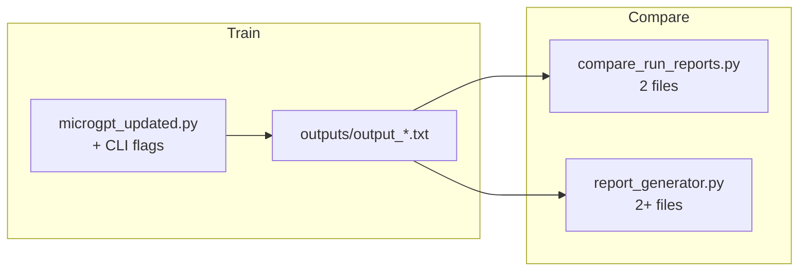

# Experiment workflow

One linear guide: **train runs → save reports → compare results**. For concepts (loss, tiers, autograd), see [`learn-before-you-code.md`](./learn-before-you-code.md). For CLI flag tables, see [`README.md`](../README.md).

---

## What you are doing

Each training run produces a **run report** (`outputs/output_*.txt`): config, final loss, 20 generated lines, and quality metrics. Experiments are just **multiple runs with different settings**, then **diff or tabulate** the reports.

**No time to train?** Skip to [Compare without training](#compare-without-training) using checked-in files in [`example-experiments/`](../example-experiments/).

---

## End-to-end flow



| Step | Action | Output |
|------|--------|--------|
| 1 | Run training with desired flags | `outputs/output_L…_YYYYMMDD_HHMMSS.txt` |
| 2 | Repeat with changed flags (e.g. `--n-head 1`) | Another report (timestamp prevents overwrite) |
| 3a | Diff **two** reports | Terminal diff + optional loss ASCII |
| 3b | Summarize **many** reports | `comparison_report.html` in browser |

Reports land in **`outputs/`** (gitignored). Demo artifacts live in **`example-experiments/`** (tracked).

---

## Quick recipe: head-count comparison

Compare **4 heads vs 1 head** at 1000 steps (same seed and data as project defaults):

```bash
# From repo root — each run takes a while (scalar autograd)
python microgpt_updated.py
python microgpt_updated.py --n-head 1

# Diff the two newest reports (adjust paths to your timestamps)
python compare_run_reports.py \
  outputs/output_L1_E16_H4_B16_S1000_T0p5_seed42_*.txt \
  outputs/output_L1_E16_H1_B16_S1000_T0p5_seed42_*.txt

# Or build HTML (explicit paths or glob under outputs/)
python experiments/report_generator.py \
  outputs/output_L1_E16_H4_B16_S1000_T0p5_seed42_*.txt \
  outputs/output_L1_E16_H1_B16_S1000_T0p5_seed42_*.txt \
  -o outputs/comparison_report.html
```

**What to look at:**

| In the report / compare output | Meaning |
|--------------------------------|---------|
| Final loss | Training fit (lower = better on training objective) |
| Inference samples | Side-by-side generated names (`*` = differ) |
| `TIER1_REAL_RATIO` etc. | Heuristic name quality ([details](./M2-semantic-quality.md)) |
| Loss history ASCII | Learning curve shape (when both reports include CSV) |

---

## Canonical sweep commands

These match the **distinct `(N_HEAD, NUM_STEPS)` pairs** used in this repo (`L=1`, `E=16`, `B=16`, `T=0.5`, `seed=42`):

```bash
python microgpt_updated.py                                    # H4, 1000 steps
python microgpt_updated.py --num-steps 2000                   # H4, 2000 steps
python microgpt_updated.py --n-head 1                         # H1, 1000 steps
python microgpt_updated.py --n-head 1 --num-steps 50          # H1, short ablation
python microgpt_updated.py --n-head 1 --num-steps 2000        # H1, 2000 steps
```

Full flag reference: `python microgpt_updated.py --help` and [README Configuration](../README.md#configuration).

---

## Label runs for HTML tables (optional)

When sweeping several variants, tag each run so the HTML report groups them:

```bash
python microgpt_updated.py --n-head 1 \
  --suite-index 1 --suite-total 2 --suite-note "head-count sweep"
python microgpt_updated.py --n-head 4 \
  --suite-index 2 --suite-total 2 --suite-note "head-count sweep"
python experiments/report_generator.py -o outputs/comparison_report.html
```

---

## Which compare tool?

| Tool | Best for | Input | Output |
|------|----------|-------|--------|
| **`compare_run_reports.py`** | Exact A vs B diff in the terminal | Exactly **2** report paths | Config diff, loss, samples, optional loss ASCII; exit `0`/`1`/`2` |
| **`experiments/report_generator.py`** | Side-by-side table for **2+** runs | Report paths or default glob `outputs/output_*.txt` | Single **HTML** page: config, quality, samples, tier bars, loss graphs |

**Rule of thumb:** use the CLI diff for a quick pairwise check; use HTML when you have a sweep or want tier bars and aligned sample grids.

```bash
# CLI — two files only
python compare_run_reports.py outputs/run_a.txt outputs/run_b.txt

# HTML — all reports under outputs/ (or pass explicit paths)
python experiments/report_generator.py
python experiments/report_generator.py path/a.txt path/b.txt -o /tmp/cmp.html
```

Compare tools **ignore** narrative and quality blocks for equality checks (CLI exit code); they still **display** quality in HTML. See [README Run reports](../README.md#run-reports).

---

## Compare without training

Open these checked-in artifacts from [`example-experiments/`](../example-experiments/):

| File | Purpose |
|------|---------|
| `output_L1_E16_H4_B16_S1000_….txt` | 4-head run report |
| `output_L1_E16_H1_B16_S1000_….txt` | 1-head run report |
| `compare-output_….txt` | Saved CLI diff |
| `comparison_report.html` | Saved HTML comparison |

```bash
python compare_run_reports.py \
  example-experiments/output_L1_E16_H4_B16_S1000_T0p5_seed42_20260424_152649.txt \
  example-experiments/output_L1_E16_H1_B16_S1000_T0p5_seed42_20260424_152836.txt

python experiments/report_generator.py \
  example-experiments/output_L1_E16_H4_B16_S1000_T0p5_seed42_20260424_152649.txt \
  example-experiments/output_L1_E16_H1_B16_S1000_T0p5_seed42_20260424_152836.txt \
  -o example-experiments/comparison_report.html
```

---

## Troubleshooting

| Problem | Fix |
|---------|-----|
| No `outputs/` folder | Created automatically on first `microgpt_updated.py` run |
| Glob does not match reports | Use full paths or `ls outputs/output_*.txt` for exact names |
| `report_generator.py` exits `2` | No input files found; pass paths or run from repo with reports in `outputs/` |
| Compare exit `2` | Bad path or unparseable report (missing final loss line) |
| Same hyperparams, many files | Expected — timestamp suffix prevents overwrite |

---

## Related docs

- [`learn-before-you-code.md`](./learn-before-you-code.md) — what loss, samples, and tiers mean
- [`M2-semantic-quality.md`](./M2-semantic-quality.md) — how generated names are scored
- [`autograd-deep-dive.md`](./autograd-deep-dive.md) — how training computes gradients
- [`README.md`](../README.md) — architecture, config tables, example artifact excerpts
